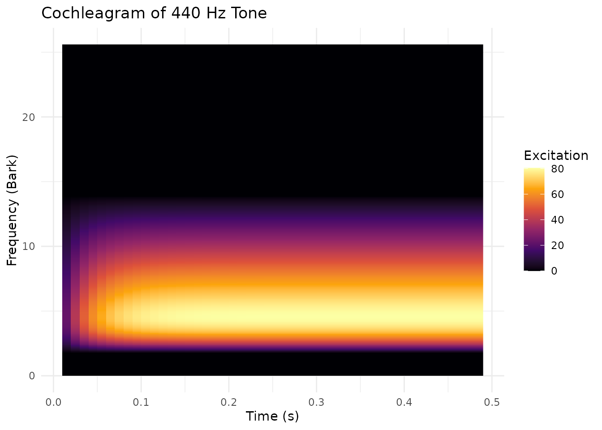

# Auditory Modeling with Cochleagram and Excitation

## Introduction

pladdrr provides auditory modeling through the **Cochleagram** and
**Excitation** objects. These model how the human auditory system
processes acoustic information, as opposed to a purely physical
(spectral) analysis.

### Key Concepts

- **Cochleagram**: Models the basilar membrane response in the cochlea
  using the **Bark scale** (0-25.6 Bark ≈ 0-20,000 Hz)
- **Excitation**: Represents auditory nerve firing patterns on the **ERB
  (Equivalent Rectangular Bandwidth) scale**
- **Loudness**: Perceptual loudness measured in sones (not physical
  intensity)
- **Perceptual Distance**: Quantifies how different two sounds “sound”
  to human listeners

``` r

library(pladdrr)
#> pladdrr: direct access to Praat's core algorithms from R.
#> See ?pladdrr for an overview, or citation("pladdrr") for citation details.
library(ggplot2)
```

## Cochleagram Analysis

### Creating a Cochleagram

The cochleagram represents sound on a frequency scale that matches the
human cochlea’s tonotopic organization.

``` r

# Load or create a sound
sound <- Sound$create_tone(frequency = 440, duration = 0.5, sampling_rate = 44100)

# Create cochleagram
cochlea <- sound$to_cochleagram(
  dt = 0.01,                    # Time step (10 ms)
  df = 0.1,                     # Frequency step in Bark
  window_length = 0.025,        # Analysis window (25 ms)
  forward_masking_time = 0.03   # Temporal masking (30 ms)
)
```

### Understanding the Bark Scale

The Bark scale is a perceptual frequency scale where: - 1 Bark ≈ 1
critical band (frequency resolution of human hearing) - 0 Bark = 0 Hz -
13 Bark ≈ 1500 Hz (center of speech range) - 25.6 Bark ≈ 20,000 Hz

``` r

# Common frequency conversions
# F1 (250 Hz) ≈ 2.5 Bark
# F2 (2000 Hz) ≈ 15 Bark
# F3 (3000 Hz) ≈ 19 Bark
```

### Querying Cochleagram Values

``` r

# Get excitation at specific time and frequency
# 440 Hz ≈ 4.2 Bark
excitation_440hz <- cochlea$get_value_at_time_and_frequency(
  time = 0.25,      # At 250 ms
  freq_bark = 4.2   # ~440 Hz
)

print(paste("Excitation at 440 Hz:", round(excitation_440hz, 4)))
#> [1] "Excitation at 440 Hz: 79.7166"
```

### Visualizing Cochleagrams

``` r

# Export to matrix for plotting
cochlea_matrix <- as.matrix(cochlea$as_matrix())

# Convert to long format for ggplot2 (rows = frequency bands, columns = time frames)
times <- sapply(seq_len(cochlea$get_number_of_frames()), cochlea$get_time_from_column)
barks <- sapply(seq_len(cochlea$get_number_of_frequency_bands()), cochlea$get_frequency_from_row)
df_long <- expand.grid(Bark = barks, Time = times)
df_long$Excitation <- as.vector(cochlea_matrix)

# Plot
ggplot(df_long, aes(x = Time, y = Bark, fill = Excitation)) +
  geom_raster() +
  scale_fill_viridis_c(option = "inferno") +
  labs(
    title = "Cochleagram of 440 Hz Tone",
    x = "Time (s)",
    y = "Frequency (Bark)",
    fill = "Excitation"
  ) +
  theme_minimal()
```



### Advanced: Ear-Drum-Brain Model

For more realistic auditory modeling, use the EDB (Ear-Drum-Brain)
method which includes synaptic processing:

``` r

cochlea_edb <- sound$to_cochleagram_edb(
  dtime = 0.01,
  dfreq = 0.1,
  has_synapse = TRUE,         # Include synaptic adaptation
  replenishment_rate = 0.01,  # Neurotransmitter replenishment
  loss_rate = 0.1,            # Synaptic depletion
  return_rate = 0.05,         # Recovery rate
  reprocessing_rate = 0.01    # Reprocessing rate
)
```

The EDB model is more computationally intensive but provides: - Synaptic
adaptation (important for continuous sounds) - More realistic temporal
response - Better modeling of masking effects

## Excitation Patterns

### Creating Excitation from Spectrum

Excitation patterns represent the instantaneous firing rate of auditory
nerve fibers:

``` r

# Create excitation from spectrum
spectrum <- sound$to_spectrum()
excitation <- spectrum$to_excitation(erb_density = 0.1)

# Get perceptual loudness
loudness <- excitation$get_loudness()
print(paste("Loudness:", round(loudness, 2), "sones"))
#> [1] "Loudness: 106.49 sones"
```

### Creating Excitation from Cochleagram

You can also extract excitation patterns at specific times from a
cochleagram:

``` r

# Extract excitation pattern at t = 0.25s
excitation_t <- cochlea$to_excitation(0.25)

# Query excitation at specific frequency
exc_value <- excitation_t$get_value_at_frequency(4.2)  # ~440 Hz
print(paste("Excitation at 440 Hz:", round(exc_value, 4)))
#> [1] "Excitation at 440 Hz: 79.7166"
```

### Perceptual Distance

Quantify how different two sounds are perceptually:

``` r

# Create two different sounds
sound1 <- Sound$create_tone(frequency = 440, duration = 0.2, sampling_rate = 22050)
sound2 <- Sound$create_tone(frequency = 550, duration = 0.2, sampling_rate = 22050)

# Get excitation patterns
exc1 <- sound1$to_spectrum()$to_excitation()
exc2 <- sound2$to_spectrum()$to_excitation()

# Calculate perceptual distance
distance <- exc1$get_distance(exc2)
print(paste("Perceptual distance:", round(distance, 4)))
#> [1] "Perceptual distance: 6.3688"
```

Higher distance values indicate sounds that are more perceptually
different.

## Clinical Applications

### Hearing Loss Simulation

Compare cochleagrams of normal and impaired hearing:

``` r

# Original speech sound
sound_original <- Sound$new(system.file("extdata", "test.wav", package = "pladdrr"))

# In practice, apply a low-pass filter to sound_filtered here to simulate
# high-frequency hearing loss (Sound objects have no clone() method, so
# start from a fresh load rather than copying sound_original)
sound_filtered <- Sound$new(system.file("extdata", "test.wav", package = "pladdrr"))

# Create cochleagrams
cochlea_normal <- sound_original$to_cochleagram()
cochlea_impaired <- sound_filtered$to_cochleagram()

# Calculate perceptual difference
difference <- cochlea_normal$get_difference(
  cochlea_impaired,
  tmin = 0,
  tmax = 0  # Full duration
)

print(paste("Hearing loss impact (distance):", round(difference, 4)))
#> [1] "Hearing loss impact (distance): 0"
```

Without an actual filtering step, `sound_original` and `sound_filtered`
are identical here, so `difference` is 0; apply a real low-pass filter
to `sound_filtered` to get a non-zero result.

### Speech Intelligibility Prediction

Excitation patterns can predict speech intelligibility. This requires
two recordings of the same material (clean and noisy); the pattern below
uses the bundled test file for both, so `distance` will be 0.

``` r

# Clean speech
speech_clean <- Sound$new(system.file("extdata", "test.wav", package = "pladdrr"))

# Noisy speech (in practice, a separate recording made in noise)
speech_noisy <- Sound$new(system.file("extdata", "test.wav", package = "pladdrr"))

# Get excitation patterns
exc_clean <- speech_clean$to_spectrum()$to_excitation()
exc_noisy <- speech_noisy$to_spectrum()$to_excitation()

# Perceptual distance correlates with intelligibility loss
distance <- exc_clean$get_distance(exc_noisy)

# Lower distance = better preserved intelligibility
distance
#> [1] 0
```

### Loudness Recruitment Assessment

Track loudness perception across intensity levels:

``` r

# Create sounds at different relative levels by scaling tone amplitude
intensities <- seq(40, 80, by = 10)  # relative dB SPL
loudnesses <- numeric(length(intensities))

for (i in seq_along(intensities)) {
  # Approximate a level in dB by scaling amplitude (20*log10(amplitude))
  amplitude <- min(0.99, 10 ^ ((intensities[i] - 80) / 20))
  sound <- Sound$create_tone(frequency = 1000, duration = 0.3,
                             amplitude = amplitude, sampling_rate = 44100)

  # Measure perceptual loudness
  excitation <- sound$to_spectrum()$to_excitation()
  loudnesses[i] <- excitation$get_loudness()
}

# Plot loudness growth function
plot(intensities, loudnesses,
     xlab = "Intensity (dB SPL)",
     ylab = "Loudness (sones)",
     main = "Loudness Growth Function",
     type = "b")
```


## Formant Extraction from Excitation

Excitation patterns provide an alternative method for formant
extraction:

``` r

# Create vowel sound
sound_vowel <- Sound$create_tone(duration = 0.2, sampling_rate = 22050)

# Get excitation pattern
excitation <- sound_vowel$to_spectrum()$to_excitation()

# Extract formants from excitation pattern
formant <- excitation$to_formant(max_formants = 5)

# Query formants
f1 <- formant$get_value_at_time(1, 0.1, unit = "hertz")
f2 <- formant$get_value_at_time(2, 0.1, unit = "hertz")

if (!is.na(f1) && !is.na(f2)) {
  print(paste("F1:", round(f1), "Hz"))
  print(paste("F2:", round(f2), "Hz"))
}
```

This method can be more robust than LPC for: - Noisy speech - Breathy
voice quality - Non-modal phonation

## Best Practices

### Choosing Parameters

**Cochleagram time step (dt)**: - Speech analysis: 0.005-0.010 s (5-10
ms) - Music: 0.010-0.020 s - Sustained sounds: 0.020-0.050 s

**Frequency step (df)**: - Detailed analysis: 0.05-0.1 Bark - Standard
analysis: 0.1-0.2 Bark - Coarse analysis: 0.2-0.5 Bark

**Window length**: - Shorter (0.005-0.010 s): Better time resolution -
Medium (0.020-0.030 s): Balanced - Longer (0.050-0.100 s): Better
frequency resolution

**Forward masking**: - Standard: 0.03 s - Strong masking: 0.05-0.1 s -
Minimal masking: 0.01-0.02 s

### Performance Considerations

``` r

# For batch processing, reuse objects when possible
sounds <- list(sound1, sound2, sound_vowel)

# Vectorized approach: build the cochleagrams once, then query all of them
cochleagrams <- lapply(sounds, function(s) {
  s$to_cochleagram(dt = 0.01, df = 0.1)
})

# Extract loudness from all
loudnesses <- sapply(cochleagrams, function(c) {
  c$get_loudness_at_time(0.1)
})
```

### Memory Management

Cochleagrams and excitation patterns can be large. Clean up when done:

``` r

# Process and extract only what you need
cochlea <- sound$to_cochleagram()
loudness_time_series <- sapply(seq(0, 0.5, by = 0.01), function(t) {
  cochlea$get_loudness_at_time(t)
})

# Remove large object if no longer needed
rm(cochlea)
gc()  # Force garbage collection
#>           used (Mb) gc trigger  (Mb) max used  (Mb)
#> Ncells 1868651 99.8    3130397 167.2  3130397 167.2
#> Vcells 3186282 24.4    8388608  64.0  7198531  55.0
```

## Comparison with Traditional Analysis

| Traditional                   | Auditory Modeling              |
|-------------------------------|--------------------------------|
| Spectrogram (linear/log Hz)   | Cochleagram (Bark scale)       |
| Spectrum power (dB)           | Excitation (nerve firing rate) |
| Sound level (dB SPL)          | Loudness (sones)               |
| Spectral distance (Euclidean) | Perceptual distance            |

Auditory modeling is preferred when: - Modeling human perception -
Clinical audiology applications - Speech intelligibility prediction -
Psychoacoustic research - Hearing aid algorithm development

## Further Reading

- **Bark scale**: Zwicker & Terhardt (1980)
- **ERB scale**: Glasberg & Moore (1990)
- **Cochleagram**: Patterson et al. (1992)
- **Excitation patterns**: Moore (2012) - *An Introduction to the
  Psychology of Hearing*

## Session Info

``` r

sessionInfo()
#> R version 4.6.1 (2026-06-24)
#> Platform: x86_64-pc-linux-gnu
#> Running under: Ubuntu 24.04.4 LTS
#> 
#> Matrix products: default
#> BLAS:   /usr/lib/x86_64-linux-gnu/openblas-pthread/libblas.so.3 
#> LAPACK: /usr/lib/x86_64-linux-gnu/openblas-pthread/libopenblasp-r0.3.26.so;  LAPACK version 3.12.0
#> 
#> locale:
#>  [1] LC_CTYPE=C.UTF-8       LC_NUMERIC=C           LC_TIME=C.UTF-8       
#>  [4] LC_COLLATE=C.UTF-8     LC_MONETARY=C.UTF-8    LC_MESSAGES=C.UTF-8   
#>  [7] LC_PAPER=C.UTF-8       LC_NAME=C              LC_ADDRESS=C          
#> [10] LC_TELEPHONE=C         LC_MEASUREMENT=C.UTF-8 LC_IDENTIFICATION=C   
#> 
#> time zone: UTC
#> tzcode source: system (glibc)
#> 
#> attached base packages:
#> [1] stats     graphics  grDevices utils     datasets  methods   base     
#> 
#> other attached packages:
#> [1] ggplot2_4.0.3 pladdrr_5.0.4
#> 
#> loaded via a namespace (and not attached):
#>  [1] gtable_0.3.6       jsonlite_2.0.0     dplyr_1.2.1        compiler_4.6.1    
#>  [5] tidyselect_1.2.1   Rcpp_1.1.2         jquerylib_0.1.4    systemfonts_1.3.2 
#>  [9] scales_1.4.0       textshaping_1.0.5  yaml_2.3.12        fastmap_1.2.0     
#> [13] R6_2.6.1           labeling_0.4.3     generics_0.1.4     knitr_1.51        
#> [17] tibble_3.3.1       desc_1.4.3         bslib_0.12.0       pillar_1.11.1     
#> [21] RColorBrewer_1.1-3 rlang_1.3.0        cachem_1.1.0       xfun_0.60         
#> [25] fs_2.1.0           sass_0.4.10        S7_0.2.2           otel_0.2.0        
#> [29] viridisLite_0.4.3  cli_3.6.6          pkgdown_2.2.1      withr_3.0.3       
#> [33] magrittr_2.0.5     digest_0.6.39      grid_4.6.1         lifecycle_1.0.5   
#> [37] vctrs_0.7.3        evaluate_1.0.5     glue_1.8.1         data.table_1.18.4 
#> [41] farver_2.1.2       codetools_0.2-20   ragg_1.5.2         rmarkdown_2.31    
#> [45] tools_4.6.1        pkgconfig_2.0.3    htmltools_0.5.9
```
