# Composable Plotting with autoplot and autolayer

``` r

library(pladdrr)
library(ggplot2)
```

## Overview

pladdrr provides
[`autoplot()`](https://ggplot2.tidyverse.org/reference/autoplot.html)
and
[`autolayer()`](https://ggplot2.tidyverse.org/reference/autolayer.html)
methods following the ggplot2 convention for visualizing acoustic data.

- **`autoplot(object)`** - Creates a complete ggplot for a single Praat
  object
- **`autolayer(object)`** - Returns layers to add to an existing plot

This pattern allows combining multiple objects in one plot:

``` r

autoplot(spec) +
  autolayer(pitch) +
  autolayer(formant)
```

## Basic Usage: Single Object Plots

Each Praat object type has an
[`autoplot()`](https://ggplot2.tidyverse.org/reference/autoplot.html)
method that creates an appropriate visualization.

``` r

# Load example sound
sound <- Sound$new(system.file("extdata", "test.wav", package = "pladdrr"))
```

### Sound Waveform

``` r

autoplot(sound)
```


### Pitch Contour

``` r

pitch <- sound$to_pitch()
autoplot(pitch)
```

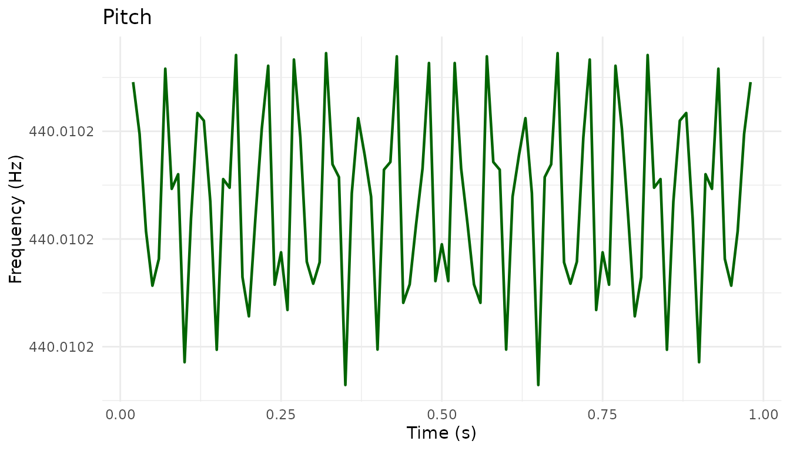

### Spectrogram

``` r

spec <- sound$to_spectrogram()
autoplot(spec, to_freq = 5000)
```

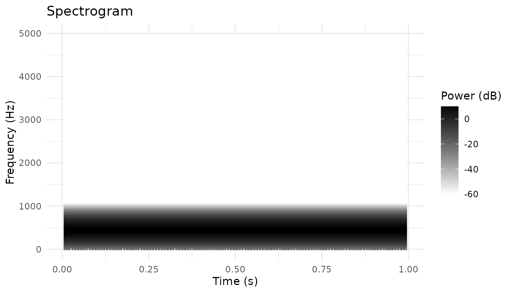

### Spectrum

``` r

spectrum <- sound$to_spectrum()
autoplot(spectrum, to_freq = 5000)
```

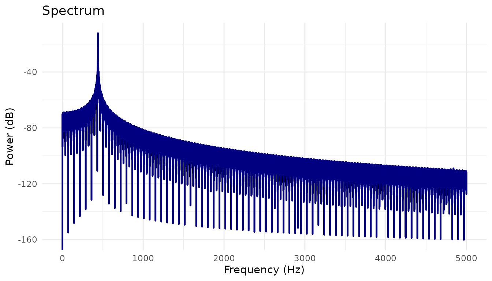

### Intensity

``` r

intensity <- sound$to_intensity()
autoplot(intensity)
```

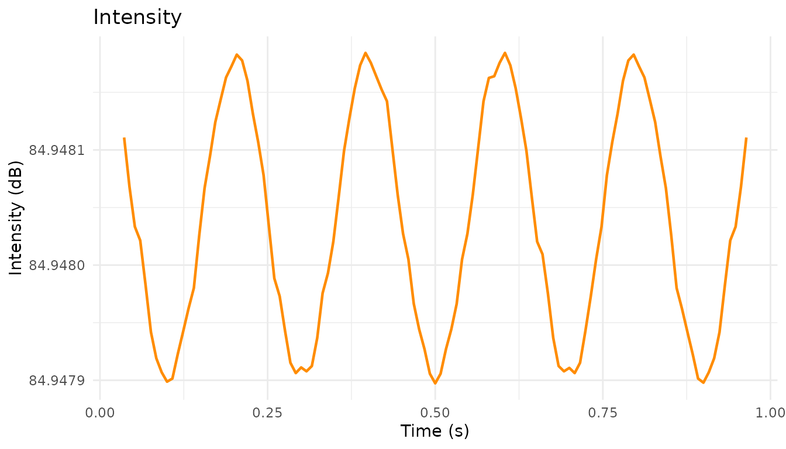

### Formants

``` r

# Formant extraction may fail on some sounds (e.g., if too short or no voiced content)
formant <- tryCatch(
  sound$to_formant_burg(),
  error = function(e) {
    message("Formant extraction failed, using synthesized vowel")
    kg <- klattgrid_create_from_vowel(duration = 0.3, f0start = 120)
    kg$to_sound()$to_formant_burg()
  }
)
autoplot(formant, max_formant = 4)
```

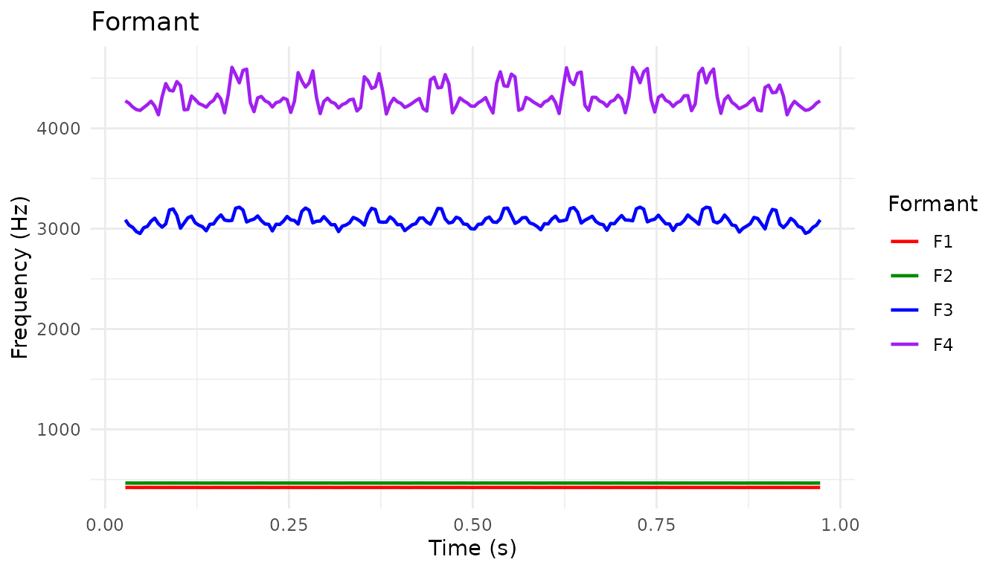

### Pitch Tier

A `PitchTier` stores sparse, hand-editable F0 points (as opposed to
`Pitch`’s dense per-frame contour) — it’s what you get from
`pitch$down_to_pitch_tier()`, and it’s the object type Praat scripts
manipulate when resynthesizing prosody.

``` r

pitch_tier <- pitch$down_to_pitch_tier()
autoplot(pitch_tier)
```

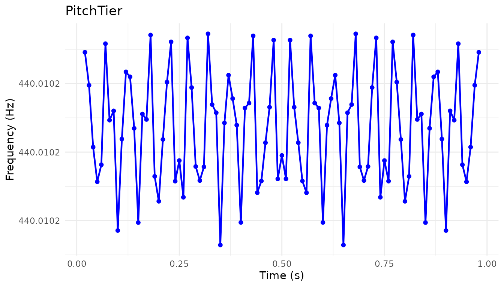

Overlay the sparse tier points on the dense pitch contour with
[`autolayer()`](https://ggplot2.tidyverse.org/reference/autolayer.html):

``` r

autoplot(pitch) +
  autolayer(pitch_tier, color = "red")
```

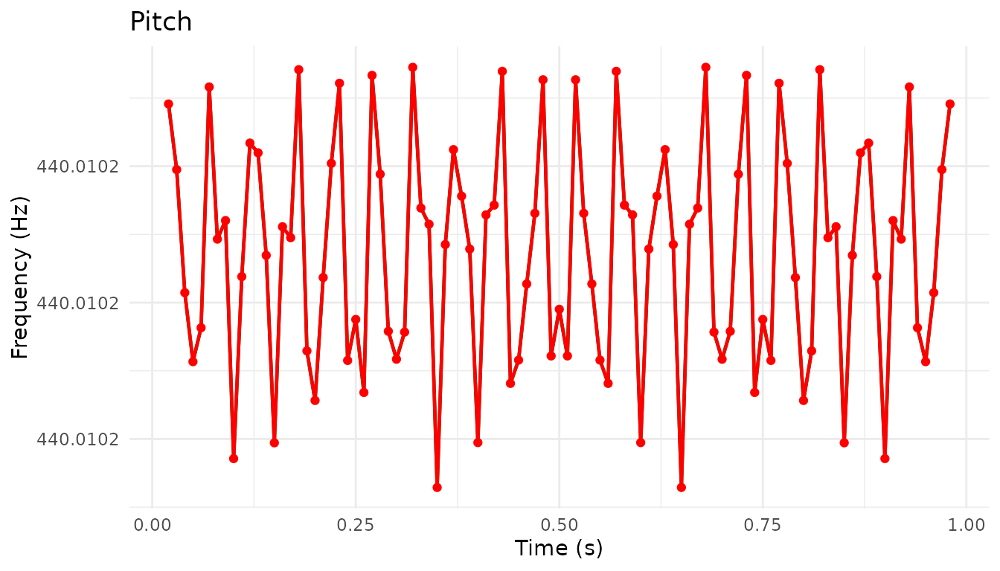

### Formant Grid and Formant Tier Styles

A `FormantGrid` holds formant frequency points directly (the editable
structure behind Klatt synthesis), while a `FormantTier` is a
downsampled view of a `Formant` object. `FormantTier`’s `style` argument
switches between `"speckle"` (default, one point per Praat-selected
candidate) and `"line"` (one interpolated point per fixed time step).

``` r

grid <- FormantGrid(tmin = 0, tmax = 1, number_of_formants = 3)
grid$add_formant_point(1, 0.5, 500)
grid$add_formant_point(2, 0.5, 1500)
grid$add_formant_point(3, 0.5, 2500)
autoplot(grid)
```

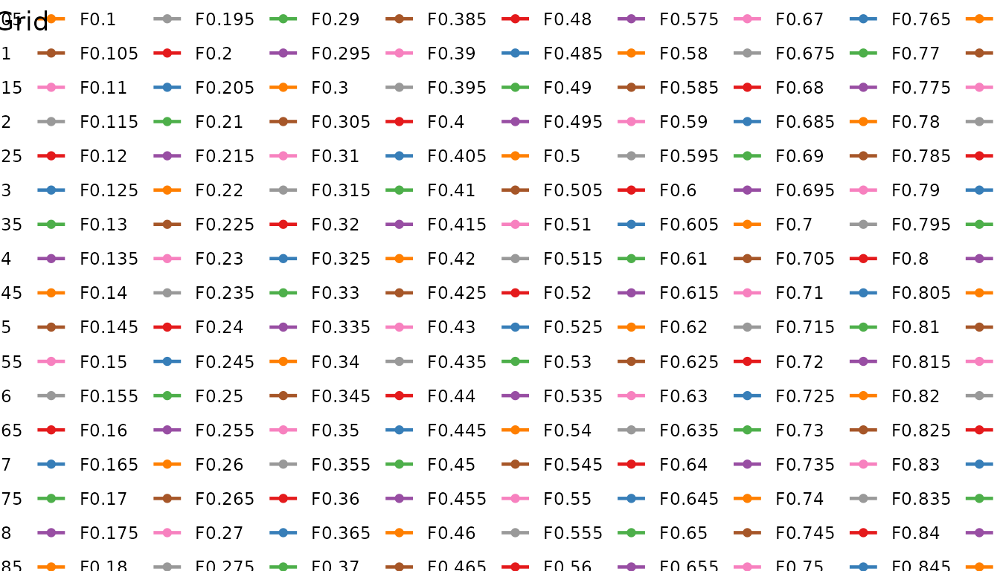

``` r

formant_tier <- FormantTier$from_formant(formant)
autoplot(formant_tier)                  # style = "speckle" (default)
```

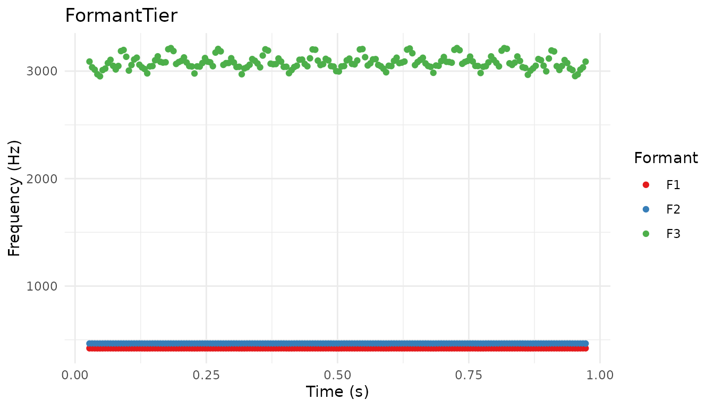

``` r

autoplot(formant_tier, style = "line")  # interpolated at a fixed time step
```

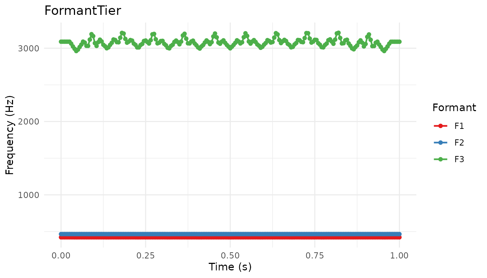

### Cepstral Analysis

`Cepstrum` supports two views of the same data via its `power` argument:
the default raw (signed) cepstrum, and a `power = TRUE` dB view used for
peak picking. `PowerCepstrogram` extends this over time and underlies
CPPS-based voice-quality measures.

``` r

cepstrum <- sound$to_cepstrum()
autoplot(cepstrum)                # raw view
```

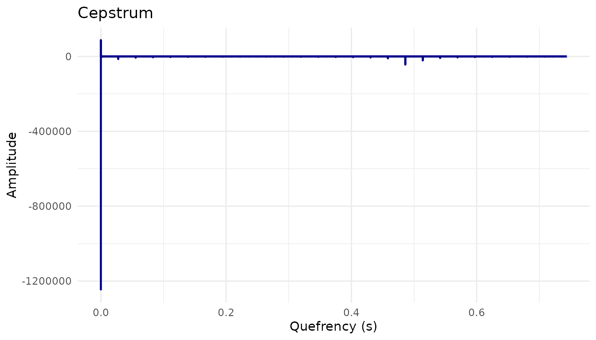

``` r

autoplot(cepstrum, power = TRUE)  # power (dB) view
```

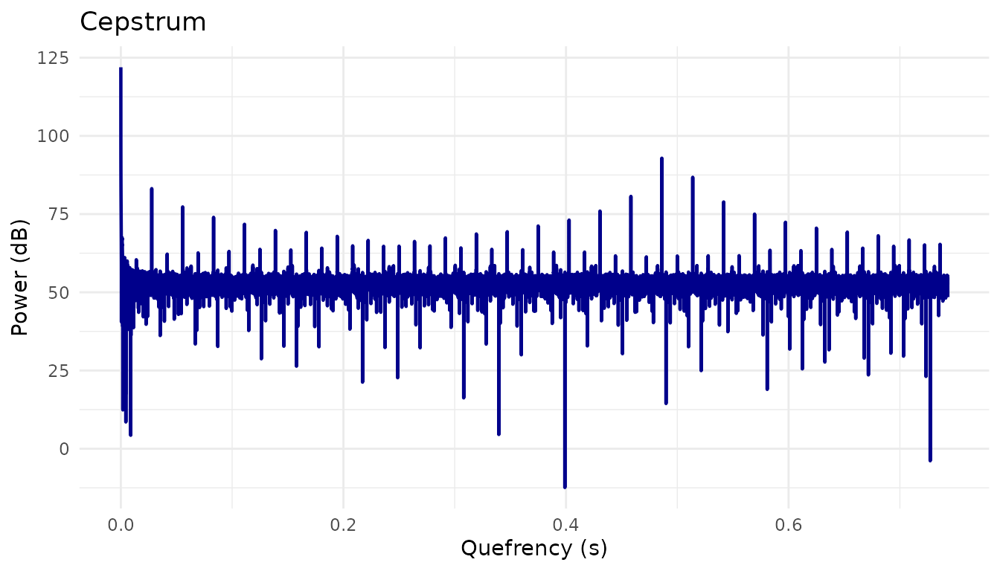

``` r

power_cepstrogram <- sound$to_powercepstrogram()
autoplot(power_cepstrogram)
```

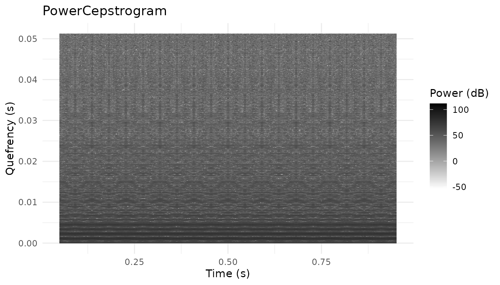

## Composing Multi-Layer Plots

Combine objects using
[`autolayer()`](https://ggplot2.tidyverse.org/reference/autolayer.html).

### Spectrogram with Pitch Overlay

``` r

autoplot(spec, to_freq = 5000) +
  autolayer(pitch, color = "cyan", geom = "point")
```

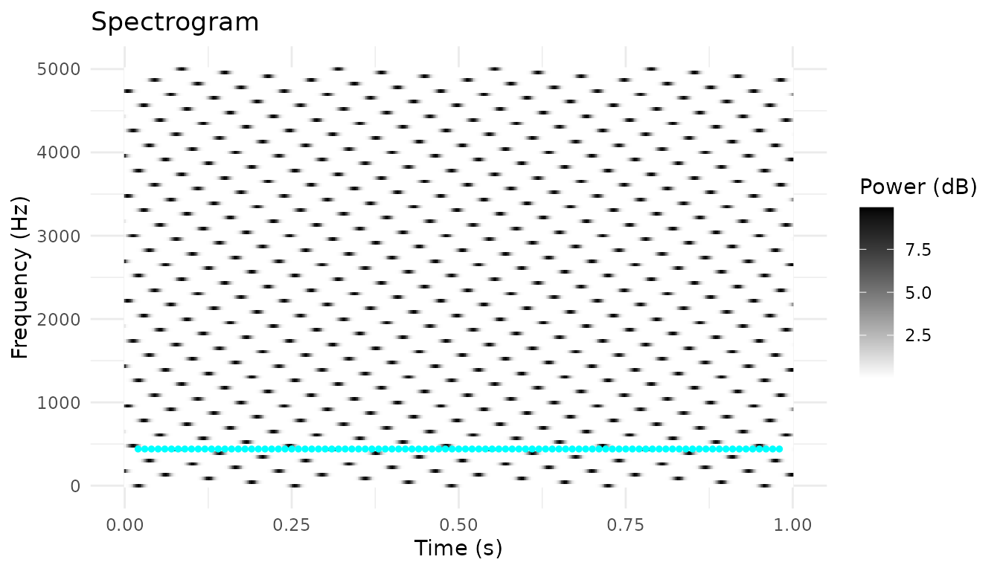

### Spectrogram with Formant Tracks

``` r

autoplot(spec, to_freq = 5000) +
  autolayer(formant, max_formant = 3)
```

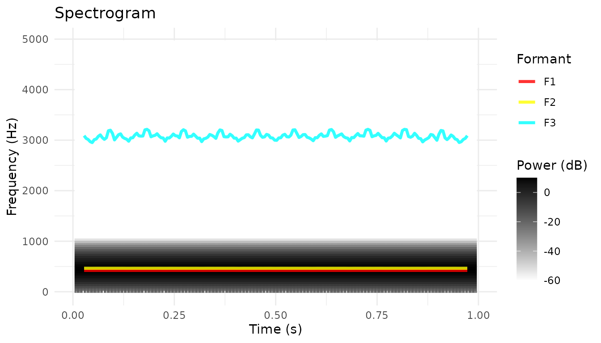

### Spectrogram with Pitch and Formants

``` r

autoplot(spec, to_freq = 5000) +
  autolayer(formant, max_formant = 3) +
  autolayer(pitch, color = "white", geom = "point")
```

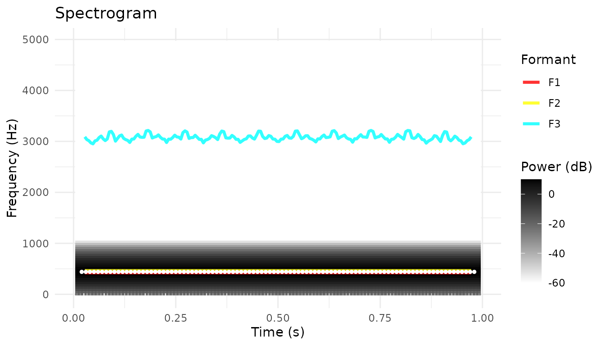

### Sound with Pitch Overlay

Overlay pitch points on waveform (useful for seeing voicing):

``` r

# Scale pitch to amplitude range for overlay
pitch_df <- pitch$as_data_frame()
pitch_df <- pitch_df[!is.na(pitch_df$frequency) & pitch_df$frequency > 0, ]

autoplot(sound) +
  geom_point(
    data = pitch_df,
    aes(x = time, y = 0),
    color = "red", size = 0.5, alpha = 0.5
  )
```

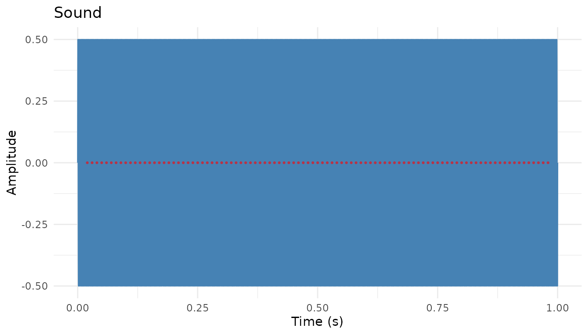

## Customization with ggplot2

All autoplot/autolayer methods return ggplot2 objects, so you can
customize freely.

### Custom Themes

``` r

autoplot(pitch) +
  theme_classic() +
  labs(
    title = "Fundamental Frequency",
    subtitle = "Extracted using autocorrelation method"
  )
```

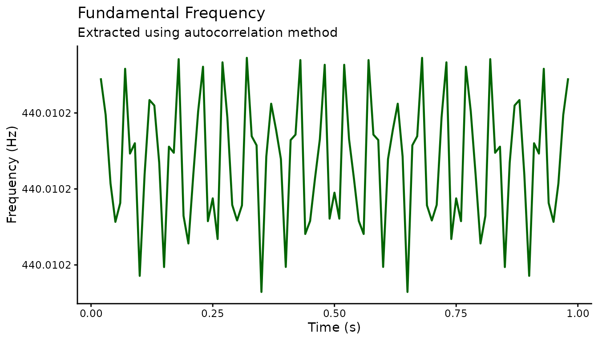

### Custom Colors

``` r

autoplot(spec, to_freq = 5000) +
  scale_fill_viridis_c(option = "magma") +
  theme_dark()
#> Scale for fill is already present.
#> Adding another scale for fill, which will replace the existing scale.
```

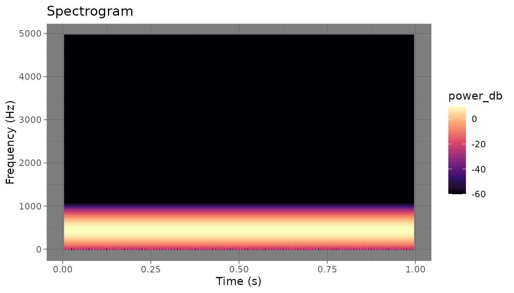

### Faceting by Time Windows

``` r

# Create intensity plot with reference lines
autoplot(intensity) +
  geom_hline(yintercept = c(50, 60, 70), linetype = "dashed", alpha = 0.3) +
  annotate("text", x = 0, y = 70, label = "Loud", hjust = 0, size = 3) +
  annotate("text", x = 0, y = 50, label = "Quiet", hjust = 0, size = 3)
```

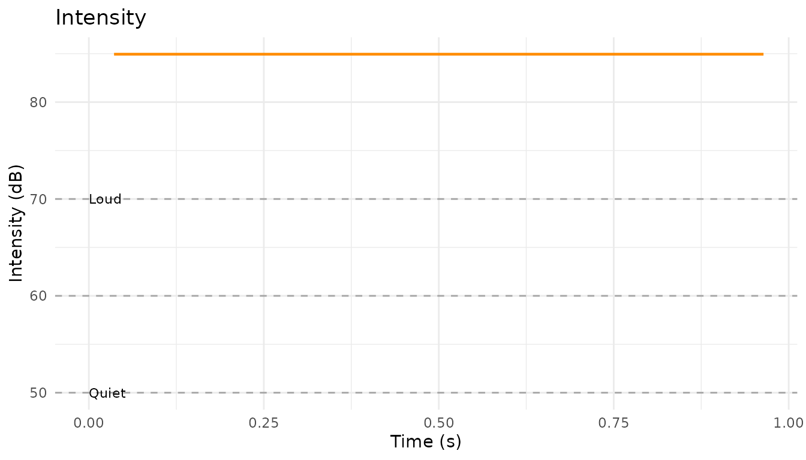

## Statistical and Alignment Tools

pladdrr also wraps a few non-acoustic-domain Praat objects used in
analysis pipelines: PCA for dimensionality reduction, and DTW for
aligning two sounds.

### PCA: Scree, Scores, and Combined Plots

[`autoplot.PCA()`](https://humlab-speech.github.io/pladdrr/reference/autoplot-methods.md)’s
`type` argument selects a scree plot (variance explained per component),
a scores plot (observations projected onto the first two components), or
`"both"` combined side-by-side via the optional patchwork package.

``` r

set.seed(1)
formant_matrix <- matrix(rnorm(200), nrow = 20)
pca <- pca_from_matrix(formant_matrix)
autoplot(pca, type = "scree")
```

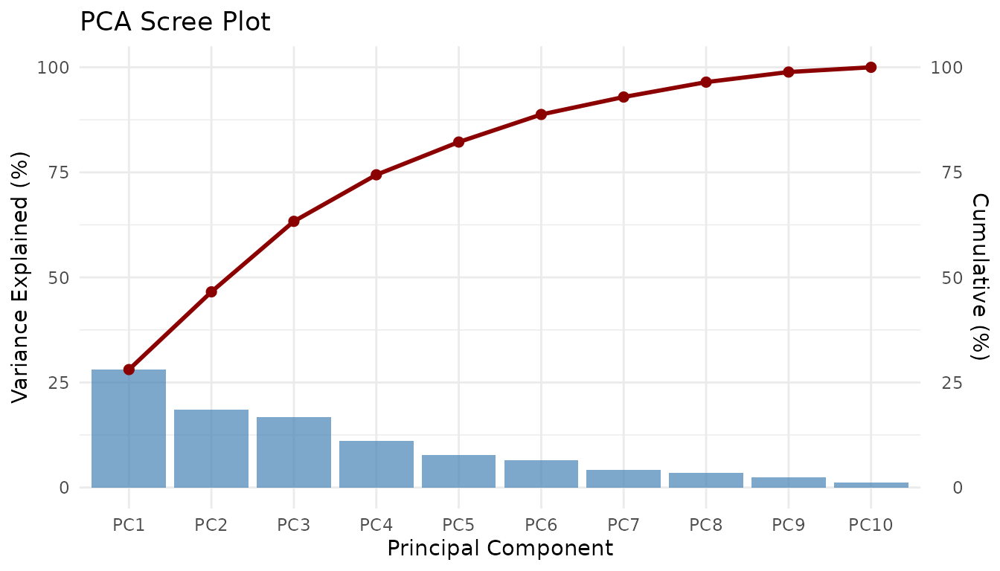

``` r

autoplot(pca, type = "scores")
```

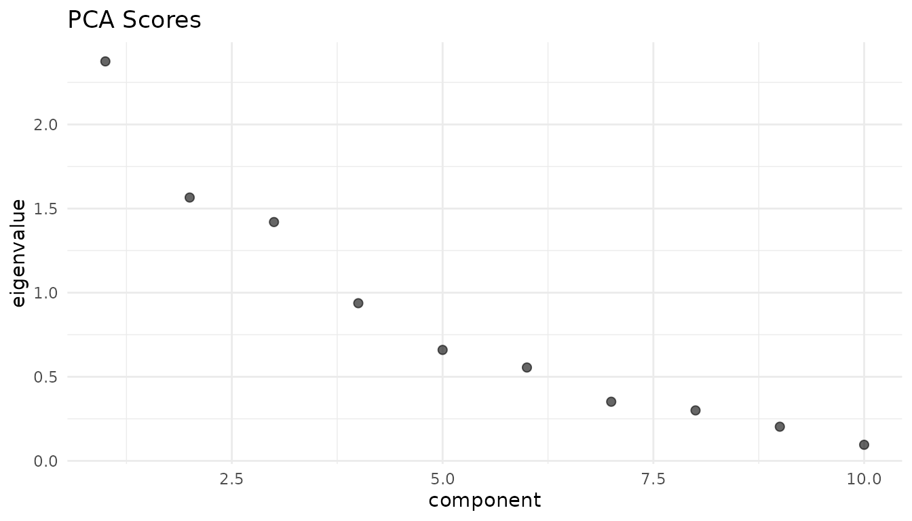

``` r

autoplot(pca, type = "both")
```

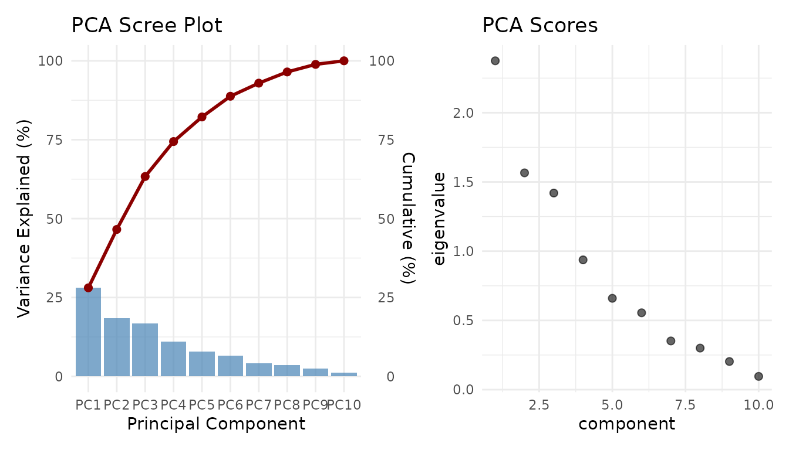

### DTW Warping Path

Dynamic Time Warping aligns two sounds (or feature sequences) that
differ in timing —
[`autoplot.DTW()`](https://humlab-speech.github.io/pladdrr/reference/autoplot-methods.md)
plots the resulting warping path, and
[`autolayer.DTW()`](https://humlab-speech.github.io/pladdrr/reference/autoplot-methods.md)
overlays it on an existing plot.

``` r

dtw_sound <- generate_sine_wave(440, 0.1, sampling_rate = 16000)
dtw <- sounds_to_dtw(dtw_sound, dtw_sound)
autoplot(dtw)
```

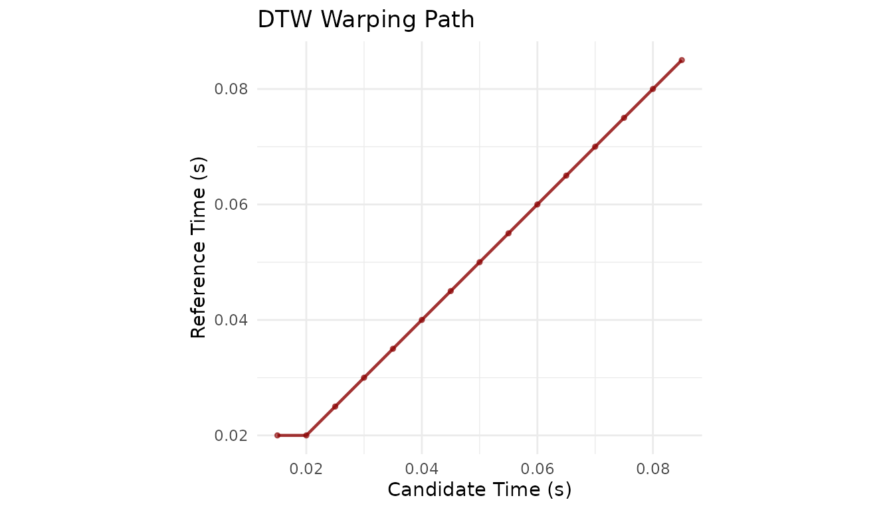

``` r

autoplot(dtw) +
  autolayer(dtw, color = "orange")
#> Warning: Duplicated aesthetics after name standardisation:
#> colour
```


## Parameter Reference

### Common Parameters

| Parameter   | Description          | Default      |
|-------------|----------------------|--------------|
| `from_time` | Start time (seconds) | NULL (start) |
| `to_time`   | End time (seconds)   | NULL (end)   |
| `color`     | Line/point color     | varies       |

### Spectrogram Parameters

| Parameter       | Description        | Default        |
|-----------------|--------------------|----------------|
| `from_freq`     | Min frequency (Hz) | NULL (0)       |
| `to_freq`       | Max frequency (Hz) | NULL (Nyquist) |
| `dynamic_range` | Dynamic range (dB) | 70             |

### Formant Parameters

| Parameter     | Description               | Default |
|---------------|---------------------------|---------|
| `max_formant` | Max formant number        | 3       |
| `colors`      | Color vector for formants | auto    |

### Pitch autolayer Parameters

| Parameter | Description       | Default |
|-----------|-------------------|---------|
| `geom`    | “line” or “point” | “line”  |

## Comparison with plot() Methods

pladdrr also provides traditional
[`plot()`](https://rdrr.io/r/graphics/plot.default.html) S3 methods.
Here’s when to use each:

| Use Case | Recommended |
|----|----|
| Quick single-object plot | `plot(object)` or `autoplot(object)` |
| Multi-object composition | `autoplot() + autolayer()` |
| Maximum customization | [`autoplot()`](https://ggplot2.tidyverse.org/reference/autoplot.html) (returns ggplot2) |
| Base R graphics pipeline | [`plot()`](https://rdrr.io/r/graphics/plot.default.html) |

## Saving Plots

``` r

# Create composed plot
p <- autoplot(spec, to_freq = 5000) +
  autolayer(formant, max_formant = 3) +
  autolayer(pitch, color = "cyan") +
  theme_minimal() +
  labs(title = "Acoustic Analysis")

# Save as PDF (vector)
ggsave("analysis.pdf", p, width = 10, height = 6)

# Save as PNG (high-res)
ggsave("analysis.png", p, width = 10, height = 6, dpi = 300)
```

## Summary

The autoplot/autolayer pattern provides:

- **Composability** - Layer multiple acoustic objects
- **Consistency** - Same interface for all object types
- **Customization** - Full ggplot2 compatibility
- **Publication quality** - Vector graphics output

For more visualization options, see
[`vignette("visualization")`](https://humlab-speech.github.io/pladdrr/articles/visualization.md).
