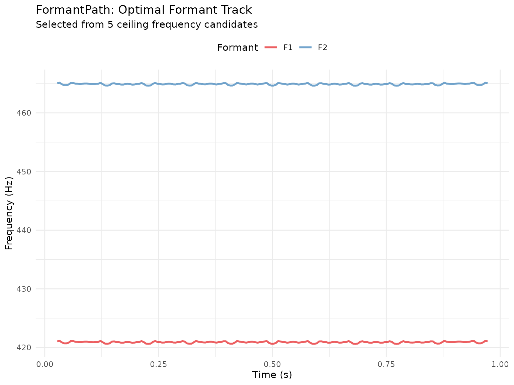
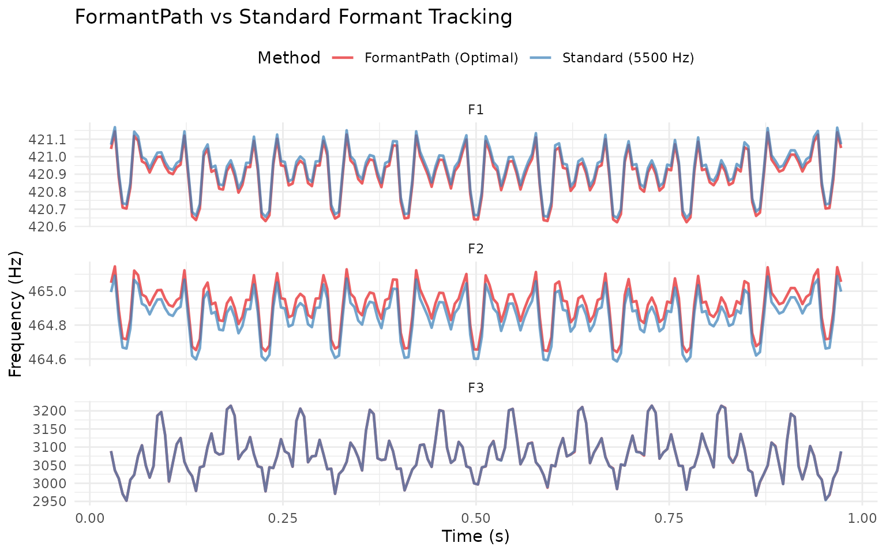

# Robust Formant Tracking with FormantPath

## Introduction

FormantPath is Praat’s advanced formant tracking algorithm that tests
multiple formant ceiling values and automatically selects the optimal
tracking path. This approach is particularly valuable when:

- Speaker characteristics are unknown (male vs female vs child)
- Audio quality is poor or contains noise
- Standard formant tracking produces spurious values
- You need maximum robustness across diverse speakers

Unlike standard formant extraction (`to_formant_burg()`), FormantPath
generates multiple candidate formant tracks with different ceiling
frequencies, then uses statistical criteria to select the best path
frame-by-frame.

``` r

library(pladdrr)
library(ggplot2)
```

## Why Use FormantPath?

### The Ceiling Frequency Problem

Formant tracking quality depends heavily on choosing the right **formant
ceiling** - the maximum frequency for formant detection:

- **Too low** (e.g., 5000 Hz for female speaker): Misses F3, tracks
  harmonics as formants
- **Too high** (e.g., 6500 Hz for male speaker): Detects spurious
  formants, poor F1/F2 accuracy
- **Just right**: Accurate F1/F2/F3 tracking with minimal errors

**FormantPath solves this** by testing multiple ceilings automatically.

### Standard vs FormantPath Comparison

``` r

# Load example audio
sound <- Sound(system.file("extdata", "test.wav", package = "pladdrr"))

# Standard method (single ceiling) - with error handling
formant_standard <- tryCatch({
  sound$to_formant_burg(
    time_step = 0.005,
    max_formants = 5,
    max_frequency = 5500,
    window_length = 0.025,
    pre_emphasis_from = 50
  )
}, error = function(e) {
  message("Standard formant extraction failed: ", e$message)
  NULL
})

# FormantPath (multiple ceilings) - with error handling
formant_path <- tryCatch({
  sound$to_formant_path(
    time_step = 0.005,
    max_num_formants = 5,
    formant_ceiling = 5500,
    num_steps_up_down = 2L  # Test 5 ceilings: ±10% around 5500 Hz
  )
}, error = function(e) {
  message("FormantPath extraction failed: ", e$message)
  NULL
})

if (!is.null(formant_standard) && !is.null(formant_path)) {
  # Extract optimal formant from path
  formant_optimal <- formant_path$extract_formant()
  
  cat("Standard method: 1 ceiling (5500 Hz)\n")
  cat("FormantPath: ", formant_path$get_number_of_candidates(), 
      " ceilings tested\n", sep = "")
  cat("Ceiling range: ", 
      round(min(formant_path$get_all_ceiling_frequencies())), " - ",
      round(max(formant_path$get_all_ceiling_frequencies())), " Hz\n", sep = "")
} else {
  cat("Note: Formant extraction requires readable audio input.\n")
  cat("Check that inst/extdata/test.wav is present and readable.\n")
}
#> Standard method: 1 ceiling (5500 Hz)
#> FormantPath: 5 ceilings tested
#> Ceiling range: 4977 - 6078 Hz
```

## Basic Usage

### Creating a FormantPath

The key parameter is `num_steps_up_down` - how many ceiling values to
test above and below the center:

``` r

# Test 3 ceilings (±5% around 5500 Hz)
fp <- sound$to_formant_path(
  time_step = 0.005,
  max_num_formants = 5,
  formant_ceiling = 5500,           # Center frequency
  ceiling_step_fraction = 0.05,     # ±5% steps
  num_steps_up_down = 1L            # 1 step up, 1 down = 3 total
)

cat("Created FormantPath with:\n")
#> Created FormantPath with:
cat("  Duration:", fp$get_duration(), "seconds\n")
#>   Duration: 1 seconds
cat("  Frames:", fp$get_nx(), "\n")
#>   Frames: 190
cat("  Candidates:", fp$get_number_of_candidates(), "\n")
#>   Candidates: 3
cat("  Ceilings tested:", 
    paste(round(fp$get_all_ceiling_frequencies()), collapse = ", "), 
    "Hz\n")
#>   Ceilings tested: 5232, 5500, 5782 Hz
```

### Interpreting num_steps_up_down

| `num_steps_up_down` | Ceilings Tested | Example (5500 Hz, 5% steps)     |
|---------------------|-----------------|---------------------------------|
| 0                   | 1               | 5500 Hz                         |
| 1                   | 3               | 5225, 5500, 5788 Hz             |
| 2                   | 5               | 4977, 5225, 5500, 5788, 6078 Hz |
| 3                   | 7               | 4737, 4977, … 6378 Hz           |
| 4                   | 9               | 4507, … 6696 Hz                 |

More candidates = more robust but slower and more memory.

## Querying FormantPath

### Inspecting Candidates

``` r

fp <- sound$to_formant_path(num_steps_up_down = 2L)

# Get all tested ceilings
ceilings <- fp$get_all_ceiling_frequencies()
cat("Tested ceilings (Hz):\n")
#> Tested ceilings (Hz):
print(round(ceilings))
#> [1] 4977 5232 5500 5782 6078

# Check which candidate was chosen in middle frame
mid_frame <- fp$get_nx() %/% 2
chosen_candidate <- fp$get_candidate_in_frame(mid_frame)
chosen_ceiling <- fp$get_ceiling_frequency(chosen_candidate)

cat("\nAt frame", mid_frame, "(mid-point):\n")
#> 
#> At frame 95 (mid-point):
cat("  Chosen candidate:", chosen_candidate, "\n")
#>   Chosen candidate: 3
cat("  Ceiling:", round(chosen_ceiling), "Hz\n")
#>   Ceiling: 5500 Hz
```

### Stress Values (Quality Metric)

Each candidate has a “stress” value - lower is better:

``` r

fp <- sound$to_formant_path(num_steps_up_down = 2L)

# Calculate stress for each candidate
n_candidates <- fp$get_number_of_candidates()
stresses <- sapply(1:n_candidates, function(i) {
  fp$get_stress_of_candidate(
    candidate = i,
    parameters = c(1, 1, 1, 1, 1),  # Equal weights
    powerf = 1.25
  )
})

# Find best candidate
best_idx <- which.min(stresses)
cat("Stress by candidate:\n")
#> Stress by candidate:
print(data.frame(
  Candidate = 1:n_candidates,
  Ceiling = round(fp$get_all_ceiling_frequencies()),
  Stress = round(stresses, 4)
))
#>   Candidate Ceiling Stress
#> 1         1    4977 5.8956
#> 2         2    5232 3.9507
#> 3         3    5500 3.7211
#> 4         4    5782 3.0112
#> 5         5    6078 2.9142
cat("\nLowest stress: Candidate", best_idx, 
    "(", round(fp$get_ceiling_frequency(best_idx)), "Hz )\n")
#> 
#> Lowest stress: Candidate 5 ( 6078 Hz )
```

## Extracting the Optimal Formant

### Automatic Extraction

``` r

fp <- sound$to_formant_path(num_steps_up_down = 2L)

# Extract the automatically selected optimal path
frm_result <- fp$extract_formant()

cat("Extracted formant:\n")
#> Extracted formant:
cat("  Duration:", sound$get_duration(), "seconds\n")
#>   Duration: 1 seconds
cat("  Frames:", frm_result$get_number_of_frames(), "\n")
#>   Frames: 190

# Query formant values
mid_time <- sound$get_duration() / 2
f1 <- frm_result$get_value_at_time(1, mid_time, "hertz")
f2 <- frm_result$get_value_at_time(2, mid_time, "hertz")
f3 <- frm_result$get_value_at_time(3, mid_time, "hertz")

cat("\nFormants at midpoint (", round(mid_time, 3), "s):\n", sep = "")
#> 
#> Formants at midpoint (0.5s):
cat("  F1:", round(f1), "Hz\n")
#>   F1: 421 Hz
cat("  F2:", round(f2), "Hz\n")
#>   F2: 465 Hz
cat("  F3:", round(f3), "Hz\n")
#>   F3: 2998 Hz
```

### Manual Path Selection

`set_path()` and `set_optimal_path()` let you override the automatically
selected candidate for a time range:

``` r

# Set candidate 3 for time range 0.2-0.4s
fp$set_path(tmin = 0.2, tmax = 0.4, selected_candidate = 3)

# Or set optimal path for entire duration
fp$set_optimal_path(
  tmin = fp$get_xmin(),
  tmax = fp$get_xmax(),
  parameters = c(1, 1, 1, 1, 1),
  powerf = 1.25
)

# Then extract
frm_result <- fp$extract_formant()
```

## Visualizing FormantPath Results

### Comparing All Candidates

``` r

fp <- sound$to_formant_path(num_steps_up_down = 2L)

# Export optimal formant track
df <- fp$as_data_frame()

# Plot F1 and F2
df_plot <- df[df$formant %in% 1:2, ]
df_plot$formant_num <- df_plot$formant

ggplot(df_plot, aes(time, frequency, color = factor(formant_num))) +
  geom_line(alpha = 0.7, linewidth = 1) +
  scale_color_manual(
    values = c("1" = "#E41A1C", "2" = "#377EB8"),
    labels = c("F1", "F2")
  ) +
  labs(
    title = "FormantPath: Optimal Formant Track",
    subtitle = paste("Selected from", fp$get_number_of_candidates(), "ceiling frequency candidates"),
    x = "Time (s)",
    y = "Frequency (Hz)",
    color = "Formant"
  ) +
  theme_minimal() +
  theme(legend.position = "top")
```



### Optimal Path vs Standard

``` r

# Get optimal formant from FormantPath
fp <- sound$to_formant_path(num_steps_up_down = 2L)
formant_optimal <- fp$extract_formant()
df_optimal <- as.data.frame(formant_optimal)
df_optimal$method <- "FormantPath (Optimal)"

# Standard single-ceiling with full parameters
formant_standard <- sound$to_formant_burg(
  time_step = 0.005,
  max_formants = 5,
  max_frequency = 5500,
  window_length = 0.025,
  pre_emphasis_from = 50
)
df_standard <- as.data.frame(formant_standard)
df_standard$method <- "Standard (5500 Hz)"

# Combine and plot
combined_df <- rbind(df_optimal, df_standard)
combined_df <- combined_df[combined_df$formant %in% 1:3, ]
ggplot(combined_df, aes(time, frequency, color = method)) +
  geom_line(alpha = 0.7, linewidth = 0.8) +
  facet_wrap(~ paste0("F", formant), ncol = 1, scales = "free_y") +
  scale_color_manual(values = c(
    "FormantPath (Optimal)" = "#E41A1C",
    "Standard (5500 Hz)" = "#377EB8"
  )) +
  labs(
    title = "FormantPath vs Standard Formant Tracking",
    x = "Time (s)",
    y = "Frequency (Hz)",
    color = "Method"
  ) +
  theme_minimal() +
  theme(legend.position = "top")
```



## Advanced Path Finding

### Viterbi-Style Path Optimization

FormantPath can use a Viterbi-like algorithm to find the globally
optimal path:

``` r

fp <- sound$to_formant_path(num_steps_up_down = 3L)

# Find optimal path with custom weights
fp$path_finder(
  q_weight = 1.0,                        # Formant quality
  frequency_change_weight = 1.0,         # Smoothness penalty
  stress_weight = 1.0,                   # Model fit
  ceiling_change_weight = 1.0,           # Consistency bonus
  intensity_modulation_step_size = 5.0,
  window_length = 0.025,
  parameters = c(1, 1, 1, 1, 1),
  powerf = 1.25
)

frm_result <- fp$extract_formant()
```

**Weight meanings**:

- `q_weight`: Prefer higher formant quality scores
- `frequency_change_weight`: Penalize large formant jumps
- `stress_weight`: Prefer lower stress (better model fit)
- `ceiling_change_weight`: Prefer consistent ceiling choice

## Use Cases

### 1. Unknown Speaker Demographics

When you don’t know if the speaker is male, female, or child:

``` r

# Test wide range of ceilings
fp <- sound$to_formant_path(
  formant_ceiling = 5500,      # Middle ground
  ceiling_step_fraction = 0.10, # ±10% steps (wider range)
  num_steps_up_down = 3L       # 7 candidates: 4500-6800 Hz
)

ceilings <- fp$get_all_ceiling_frequencies()
cat("Testing range:", round(min(ceilings)), "-", 
    round(max(ceilings)), "Hz\n")
#> Testing range: 4075 - 7424 Hz
cat("Covers: Male (5000), Female (5500), Child (6500+)\n")
#> Covers: Male (5000), Female (5500), Child (6500+)

frm_result <- fp$extract_formant()
```

### 2. Noisy or Difficult Audio

For poor quality audio, use more candidates and tighter steps:

``` r

fp <- sound$to_formant_path(
  formant_ceiling = 5500,
  ceiling_step_fraction = 0.05,  # Finer steps
  num_steps_up_down = 4L,        # More candidates (9 total)
  window_length = 0.030          # Longer window for stability
)

cat("Using", fp$get_number_of_candidates(), "candidates for robustness\n")
#> Using 9 candidates for robustness
```

### 3. Segment-Specific Analysis

Compare formants across time-aligned segments using a TextGrid:

``` r

textgrid <- TextGrid(system.file("extdata", "test.TextGrid", package = "pladdrr"))

# Get labelled intervals from the phone tier
intervals <- textgrid$get_all_intervals("phones")
intervals <- intervals[intervals$text != "", ]

# test.TextGrid spans 3s but test.wav is only 1s - clip segment
# boundaries to the sound's actual duration before extracting
intervals$end <- pmin(intervals$end, sound$get_duration())
intervals <- intervals[intervals$start < intervals$end, ]

# Analyze each segment with FormantPath
results <- lapply(seq_len(nrow(intervals)), function(i) {
  seg <- intervals[i, ]
  segment_sound <- sound$extract_part(seg$start, seg$end)

  fp <- segment_sound$to_formant_path(num_steps_up_down = 2L)
  frm_result <- fp$extract_formant()

  df <- as.data.frame(frm_result)
  data.frame(
    phone = seg$text,
    f1 = mean(df$frequency[df$formant == 1], na.rm = TRUE),
    f2 = mean(df$frequency[df$formant == 2], na.rm = TRUE)
  )
})

phone_formants <- do.call(rbind, results)
print(phone_formants)
#>   phone       f1       f2
#> 1     h 420.9057 464.9144
#> 2     ɛ 420.9347 464.9425
```

### 4. Batch Processing Multiple Files

``` r

# Process multiple recordings with unknown speaker characteristics.
# Replace `files` with your own vector of file paths; here we reuse the
# bundled example file to show the pattern.
files <- rep(system.file("extdata", "test.wav", package = "pladdrr"), 3)

formants <- lapply(files, function(file) {
  sound <- Sound(file)
  fp <- sound$to_formant_path(
    formant_ceiling = 5500,
    num_steps_up_down = 2L
  )
  fp$extract_formant()
})

names(formants) <- files
```

## Performance Considerations

### Memory Usage

FormantPath stores multiple formant candidates:

``` r

# 5 candidates = 5× the memory of standard Formant
fp <- sound$to_formant_path(num_steps_up_down = 2L)  # 5 candidates
# Memory ≈ 5 × size of single Formant object
```

**Tips**: - Use fewer candidates for long files
(`num_steps_up_down = 1`) - Extract and discard FormantPath after
getting optimal Formant - Process files individually rather than loading
all in memory

### Computation Cost

FormantPath fits `num_candidates` formant tracks per call instead of
one, so expect its cost to scale roughly with the number of candidates
requested. Measure on your own data:

``` r

system.time(frm_result <- sound$to_formant_burg())
#>    user  system elapsed 
#>   0.012   0.001   0.007
system.time(fp <- sound$to_formant_path(num_steps_up_down = 2L))
#>    user  system elapsed 
#>   0.045   0.000   0.029
```

## Best Practices

### DO

1.  **Use FormantPath when speaker characteristics are unknown**

2.  **Start with `num_steps_up_down = 2`** (5 candidates) as default

3.  **Extract the formant immediately** to save memory:

    ``` r

    frm_result <- sound$to_formant_path(num_steps_up_down = 2L)$extract_formant()
    ```

4.  **Compare candidates visually** when results look suspicious

5.  **Use wider step fractions (0.10)** for diverse speakers

6.  **Document which method you used** for reproducibility

### DON’T

1.  **Don’t use FormantPath for all analyses** - use the standard method
    when the speaker’s formant range is already known
2.  **Don’t use too many candidates** (`num_steps_up_down > 4`) unless
    necessary
3.  **Don’t forget to extract** - FormantPath itself isn’t directly
    usable
4.  **Don’t assume optimal = perfect** - always inspect difficult cases
5.  **Don’t ignore stress values** - high stress indicates poor fit

## Comparison with Other Tools

### pladdrr FormantPath vs Praat

pladdrr provides direct R access to Praat’s FormantPath algorithm:

| Feature | pladdrr | Praat GUI |
|----|----|----|
| Multiple candidates | Yes | Yes |
| Automatic path selection | Yes | Yes |
| Manual path override | Yes, but see the known crash noted above | Yes |
| Data export | Yes (data.frame) | Yes (text file) |
| Batch processing | Yes (R loops) | No (manual) |
| Visualization | Yes (ggplot2) | Yes (built-in) |

### vs Parselmouth

Parselmouth does not currently expose FormantPath - only standard
`to_formant()`.

## Troubleshooting

### Issue: All candidates look similar

**Cause**: Step fraction too small or range too narrow

**Solution**: Increase `ceiling_step_fraction` to 0.10 or higher

``` r

# Instead of this (too narrow)
fp <- sound$to_formant_path(
  formant_ceiling = 5500,
  ceiling_step_fraction = 0.02,  # ±2% only
  num_steps_up_down = 2L
)

# Use this (better range)
fp <- sound$to_formant_path(
  formant_ceiling = 5500,
  ceiling_step_fraction = 0.10,  # ±10%
  num_steps_up_down = 2L
)
```

### Issue: Extracted formant has gaps (NA values)

**Cause**: No candidate had valid formants at those frames

**Solution**: Increase `max_num_formants` or adjust `formant_ceiling`

``` r

fp <- sound$to_formant_path(
  max_num_formants = 6,  # Instead of 5
  formant_ceiling = 5500,
  num_steps_up_down = 2L
)
```

### Issue: FormantPath is too slow

**Solution**: Reduce candidates or increase time step

``` r

# Faster: fewer candidates, larger time step
fp <- sound$to_formant_path(
  time_step = 0.010,         # Instead of 0.005
  num_steps_up_down = 1L,    # 3 candidates instead of 5
  formant_ceiling = 5500
)
```

## Summary

**FormantPath is ideal when**: - Speaker demographics unknown - Audio
quality is poor - Need maximum robustness - Comparing diverse speakers

**Use standard formant extraction when**: - Speaker type is known
(male/female) - Audio quality is good - Speed is critical - Memory is
limited

**Key Parameters**: - `formant_ceiling`: Center frequency (5000-5500 for
adults) - `num_steps_up_down`: 1-2 for most cases, 3-4 for difficult
audio - `ceiling_step_fraction`: 0.05 (narrow) to 0.10 (wide)

## Further Reading

- Praat manual:
  [FormantPath](https://www.fon.hum.uva.nl/praat/manual/FormantPath.html)
- Weenink, D. (2015). “Improved formant frequency measurements of short
  segments”
- pladdrr documentation: `?to_formant_path`

## Session Info

``` r

sessionInfo()
#> R version 4.6.1 (2026-06-24)
#> Platform: x86_64-pc-linux-gnu
#> Running under: Ubuntu 24.04.4 LTS
#> 
#> Matrix products: default
#> BLAS:   /usr/lib/x86_64-linux-gnu/openblas-pthread/libblas.so.3 
#> LAPACK: /usr/lib/x86_64-linux-gnu/openblas-pthread/libopenblasp-r0.3.26.so;  LAPACK version 3.12.0
#> 
#> locale:
#>  [1] LC_CTYPE=C.UTF-8       LC_NUMERIC=C           LC_TIME=C.UTF-8       
#>  [4] LC_COLLATE=C.UTF-8     LC_MONETARY=C.UTF-8    LC_MESSAGES=C.UTF-8   
#>  [7] LC_PAPER=C.UTF-8       LC_NAME=C              LC_ADDRESS=C          
#> [10] LC_TELEPHONE=C         LC_MEASUREMENT=C.UTF-8 LC_IDENTIFICATION=C   
#> 
#> time zone: UTC
#> tzcode source: system (glibc)
#> 
#> attached base packages:
#> [1] stats     graphics  grDevices utils     datasets  methods   base     
#> 
#> other attached packages:
#> [1] ggplot2_4.0.3 pladdrr_5.0.4
#> 
#> loaded via a namespace (and not attached):
#>  [1] gtable_0.3.6       jsonlite_2.0.0     dplyr_1.2.1        compiler_4.6.1    
#>  [5] tidyselect_1.2.1   Rcpp_1.1.2         jquerylib_0.1.4    systemfonts_1.3.2 
#>  [9] scales_1.4.0       textshaping_1.0.5  yaml_2.3.12        fastmap_1.2.0     
#> [13] R6_2.6.1           labeling_0.4.3     generics_0.1.4     knitr_1.51        
#> [17] tibble_3.3.1       desc_1.4.3         bslib_0.12.0       pillar_1.11.1     
#> [21] RColorBrewer_1.1-3 rlang_1.3.0        cachem_1.1.0       xfun_0.60         
#> [25] fs_2.1.0           sass_0.4.10        S7_0.2.2           otel_0.2.0        
#> [29] cli_3.6.6          pkgdown_2.2.1      withr_3.0.3        magrittr_2.0.5    
#> [33] digest_0.6.39      grid_4.6.1         lifecycle_1.0.5    vctrs_0.7.3       
#> [37] evaluate_1.0.5     glue_1.8.1         data.table_1.18.4  farver_2.1.2      
#> [41] codetools_0.2-20   ragg_1.5.2         rmarkdown_2.31     tools_4.6.1       
#> [45] pkgconfig_2.0.3    htmltools_0.5.9
```
