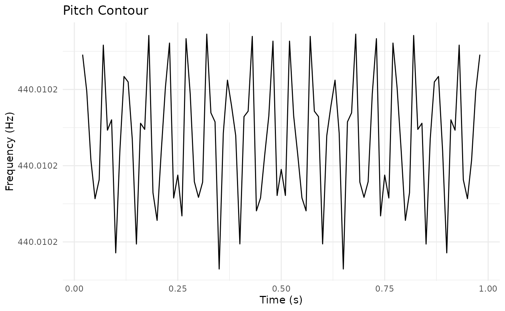

# Migration Guide: From Praat Scripts to pladdrr

## Introduction

This guide helps you translate Praat scripts into R code using pladdrr.
The package provides a direct object-oriented interface to Praat’s
functionality.

## Key Principles

### 1. Object Creation

**Praat Script:**

``` praat
sound = Read from file: "audio.wav"
```

**pladdrr:**

``` r

library(pladdrr)
#> pladdrr: direct access to Praat's core algorithms from R.
#> See ?pladdrr for an overview, or citation("pladdrr") for citation details.
sound <- Sound$new(system.file("extdata", "test.wav", package = "pladdrr"))
```

### 2. Method Calls

Praat commands become method calls following a consistent naming
pattern:

| Praat Command          | pladdrr Method      | Pattern                 |
|------------------------|---------------------|-------------------------|
| `To Pitch...`          | `to_pitch()`        | `To X` → `to_x()`       |
| `To Formant (burg)...` | `to_formant_burg()` | `To X (y)` → `to_x_y()` |
| `Get mean...`          | `get_mean()`        | `Get x` → `get_x()`     |
| `Set value...`         | `set_value()`       | `Set x` → `set_x()`     |

### 3. Parameters

Praat’s positional parameters become named parameters in R:

**Praat:**

``` praat
pitch = To Pitch: 0.01, 75, 600
```

**pladdrr:**

``` r

pitch <- sound$to_pitch(time_step = 0.01, pitch_floor = 75, pitch_ceiling = 600)
```

## Common Workflows

### Basic Pitch Analysis

**Praat Script:**

``` praat
sound = Read from file: "audio.wav"
pitch = To Pitch: 0.01, 75, 600
mean_f0 = Get mean: 0, 0, "Hertz"
std_f0 = Get standard deviation: 0, 0, "Hertz"
```

**pladdrr:**

``` r

sound <- Sound$new(system.file("extdata", "test.wav", package = "pladdrr"))
pitch <- sound$to_pitch(time_step = 0.01, pitch_floor = 75, pitch_ceiling = 600)
mean_f0 <- pitch$get_mean(from_time = 0, to_time = 0, unit = "hertz")
std_f0 <- pitch$get_standard_deviation(from_time = 0, to_time = 0, unit = "hertz")
```

### Formant Extraction

**Praat Script:**

``` praat
sound = Read from file: "vowel.wav"
formant = To Formant (burg): 0.01, 5, 5500, 0.025, 50
f1 = Get value at time: 1, 0.5, "Hertz", "Linear"
f2 = Get value at time: 2, 0.5, "Hertz", "Linear"
```

**pladdrr:**

``` r

sound <- Sound$new(system.file("extdata", "test.wav", package = "pladdrr"))
formant <- sound$to_formant_burg(
  time_step = 0.01,
  max_number_of_formants = 5,
  maximum_formant = 5500,
  window_length = 0.025,
  pre_emphasis_from = 50
)
f1 <- formant$get_value_at_time(formant_number = 1, time = 0.5, unit = "hertz")
f2 <- formant$get_value_at_time(formant_number = 2, time = 0.5, unit = "hertz")
```

### Intensity Measurements

**Praat Script:**

``` praat
sound = Read from file: "audio.wav"
intensity = To Intensity: 100, 0.01, "yes"
mean_intensity = Get mean: 0, 0, "energy"
max_intensity = Get maximum: 0, 0, "Parabolic"
```

**pladdrr:**

``` r

sound <- Sound$new(system.file("extdata", "test.wav", package = "pladdrr"))
intensity <- sound$to_intensity(minimum_pitch = 100, time_step = 0.01, subtract_mean = TRUE)
mean_intensity <- intensity$get_mean(from_time = 0, to_time = 0, averaging_method = "energy")
max_intensity <- intensity$get_maximum(from_time = 0, to_time = 0, interpolation = "parabolic")
```

### Spectral Analysis

**Praat Script:**

``` praat
sound = Read from file: "audio.wav"
spectrum = To Spectrum: "yes"
cog = Get centre of gravity: 2.0
```

**pladdrr:**

``` r

sound <- Sound$new(system.file("extdata", "test.wav", package = "pladdrr"))
spectrum <- sound$to_spectrum(fast = TRUE)
cog <- spectrum$get_centre_of_gravity(power = 2.0)
```

### TextGrid Manipulation

**Praat Script:**

``` praat
textgrid = Create TextGrid: 0, 1, "words phones", "phones"
Insert boundary: 1, 0.5
Set interval text: 1, 1, "hello"
```

**pladdrr:**

``` r

textgrid <- TextGrid$create(tmin = 0, tmax = 1, tier_names = "words phones", point_tiers = "phones")
textgrid$insert_boundary(tier = 1, time = 0.5)
textgrid$set_interval_text(tier = 1, interval_number = 1, text = "hello")
```

## Batch Processing

### Praat Script Approach

``` praat
Create Strings as file list: "fileList", "*.wav"
numberOfFiles = Get number of strings

for ifile to numberOfFiles
    selectObject: "Strings fileList"
    fileName$ = Get string: ifile
    sound = Read from file: fileName$
    
    pitch = To Pitch: 0.01, 75, 600
    mean_f0 = Get mean: 0, 0, "Hertz"
    
    appendFileLine: "results.txt", fileName$, tab$, mean_f0
    
    removeObject: sound, pitch
endfor
```

### pladdrr Approach

``` r

library(pladdrr)

# Get list of WAV files
files <- list.files(pattern = "\\.wav$", full.names = TRUE)

# Process each file
results <- lapply(files, function(filepath) {
  sound <- Sound$new(filepath)
  pitch <- sound$to_pitch(time_step = 0.01, pitch_floor = 75, pitch_ceiling = 600)
  mean_f0 <- pitch$get_mean(from_time = 0, to_time = 0, unit = "hertz")
  
  data.frame(
    file = basename(filepath),
    mean_f0 = mean_f0
  )
})

# Combine results
results_df <- do.call(rbind, results)
write.csv(results_df, file.path(tempdir(), "results.csv"), row.names = FALSE)
```

## Advanced Features in pladdrr

### Integration with tidyverse

``` r

library(pladdrr)
library(dplyr)
#> 
#> Attaching package: 'dplyr'
#> The following objects are masked from 'package:stats':
#> 
#>     filter, lag
#> The following objects are masked from 'package:base':
#> 
#>     intersect, setdiff, setequal, union
library(purrr)

results <- tibble(file = list.files(pattern = "\\.wav$")) %>%
  mutate(
    sound = map(file, Sound$new),
    pitch = map(sound, ~.$to_pitch(time_step = 0.01, pitch_floor = 75, pitch_ceiling = 600)),
    mean_f0 = map_dbl(pitch, ~.$get_mean(from_time = 0, to_time = 0, unit = "hertz")),
    sd_f0 = map_dbl(pitch, ~.$get_standard_deviation(from_time = 0, to_time = 0, unit = "hertz"))
  ) %>%
  select(file, mean_f0, sd_f0)
```

### Visualization with ggplot2

``` r

library(ggplot2)

# Extract pitch contour
sound <- Sound$new(system.file("extdata", "test.wav", package = "pladdrr"))
pitch <- sound$to_pitch(time_step = 0.01, pitch_floor = 75, pitch_ceiling = 600)
pitch_data <- pitch$as_data_frame()

# Plot
ggplot(pitch_data, aes(x = time, y = frequency)) +
  geom_line() +
  labs(title = "Pitch Contour", x = "Time (s)", y = "Frequency (Hz)") +
  theme_minimal()
```



## Advantages Over Praat Scripts

1.  **Type Safety**: R catches type errors at runtime
2.  **Code Completion**: RStudio provides autocomplete for all methods
3.  **Integration**: Works with R’s data analysis ecosystem (dplyr,
    purrr, ggplot2, etc.)
4.  **Reproducibility**: Version control and package management
5.  **Performance**: Direct C++ binding (no scripting overhead)
6.  **Memory Management**: Automatic cleanup of Praat objects

## Common Pitfalls

### 1. Object Lifetime

**Praat** uses explicit object selection and removal:

``` praat
selectObject: sound
removeObject: sound
```

**pladdrr** uses R’s garbage collection (automatic):

``` r

# Objects are automatically cleaned up when no longer referenced
sound <- Sound$new(system.file("extdata", "test.wav", package = "pladdrr"))
# 'sound' is freed when it goes out of scope or is reassigned
```

### 2. Time Ranges

**Praat** uses `0, 0` to mean “entire range”:

``` praat
mean_f0 = Get mean: 0, 0, "Hertz"
```

**pladdrr** follows the same convention:

``` r

mean_f0 <- pitch$get_mean(from_time = 0, to_time = 0, unit = "hertz")
```

### 3. Unit Strings

Use lowercase for units in pladdrr:

``` r

# Correct
pitch$get_mean(unit = "hertz")
#> [1] 440.0102

# Also works (case-insensitive in many methods)
pitch$get_mean(unit = "Hertz")
#> [1] 440.0102
```

## Getting Help

- Package documentation:
  [`help(package = "pladdrr")`](https://humlab-speech.github.io/pladdrr/reference)
- Class methods:
  [`?Sound`](https://humlab-speech.github.io/pladdrr/reference/Sound.md),
  [`?Pitch`](https://humlab-speech.github.io/pladdrr/reference/Pitch.md),
  [`?Formant`](https://humlab-speech.github.io/pladdrr/reference/Formant.md),
  etc.
- Vignettes: `vignette(package = "pladdrr")`
- Maintainer: <fredrik.nylen@umu.se>

## Conclusion

Most translations follow a simple pattern: convert Praat commands to
lowercase method names with underscores, and use named parameters.

For complex workflows, pladdrr can be combined with R’s data
manipulation and visualization packages (e.g. dplyr, purrr, ggplot2).
