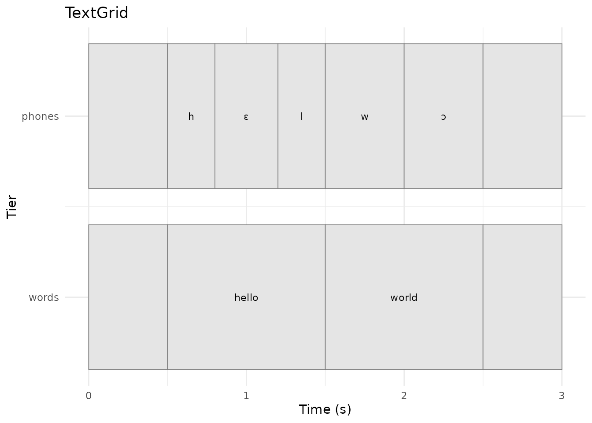
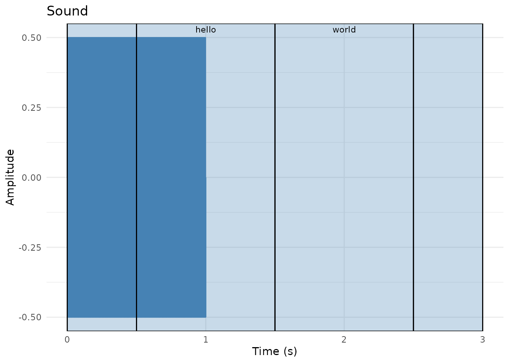

# TextGrid Workflows with pladdrr

## Overview

TextGrids are Praat’s standard format for time-aligned speech
annotation. This vignette demonstrates:

- **Creating TextGrids** from scratch or from existing files
- **Querying annotations** (intervals, points, boundaries)
- **Modifying annotations** (insert, delete, relabel)
- **Tier management** (add, remove, rename)
- **Large-scale corpus processing** with performance optimization
- **Data export** to R data frames and CSV
- **Integration with forced alignment** tools

TextGrids are used throughout phonetic research for time-aligned
annotation of speech data.

## Background

### TextGrid Structure

A TextGrid contains **tiers** of two types:

1.  **Interval tiers**: Contiguous segments with start/end times and
    labels
    - Use cases: words, phones, syllables, utterances, speaker turns
    - Each interval has: start time, end time, text label
2.  **Point tiers**: Discrete time points with labels
    - Use cases: landmarks (e.g., burst release, vowel onset), events,
      boundaries
    - Each point has: time, text label

### Common Workflows

**Manual annotation**: - Create TextGrid in Praat - Manually segment and
label - Load in R for analysis

**Forced alignment**: - Use tools like Montreal Forced Aligner, WebMAUS,
or Gentle - Generates word- and phone-level TextGrids automatically -
Load in R for quality control and analysis

**Hybrid approach**: - Automatic alignment for initial segmentation -
Manual correction in Praat - Batch analysis in R

## Part 1: Creating TextGrids

### Creating from Scratch

``` r

library(pladdrr)
#> pladdrr: direct access to Praat's core algorithms from R.
#> See ?pladdrr for an overview, or citation("pladdrr") for citation details.

# Create a TextGrid with multiple tiers.
# tier_names lists ALL tiers to create; point_tiers is the subset of those
# names that should be PointTiers instead of IntervalTiers (a tier must
# appear in tier_names before it can be designated a point tier).
tg <- TextGrid$create(
  tmin = 0,
  tmax = 10,
  tier_names = "utterances words phones events",
  point_tiers = "events"
)

cat("Created TextGrid with", tg$get_number_of_tiers(), "tiers\n")
#> Created TextGrid with 4 tiers
cat("Duration:", tg$get_total_duration(), "seconds\n")
#> Duration: 10 seconds
```

### Adding Interval Boundaries

``` r

# Add word boundaries to the "words" tier (tier 2)
word_tier <- 2

# Insert boundaries at specific times
tg$insert_boundary(word_tier, time = 1.0)
tg$insert_boundary(word_tier, time = 2.5)
tg$insert_boundary(word_tier, time = 4.0)
tg$insert_boundary(word_tier, time = 6.5)
tg$insert_boundary(word_tier, time = 8.0)

# Label the created intervals
tg$set_interval_text(word_tier, 1, "")
tg$set_interval_text(word_tier, 2, "hello")
tg$set_interval_text(word_tier, 3, "world")
tg$set_interval_text(word_tier, 4, "this")
tg$set_interval_text(word_tier, 5, "is")
tg$set_interval_text(word_tier, 6, "test")

cat("Added", tg$get_number_of_intervals(word_tier), "intervals to words tier\n")
#> Added 6 intervals to words tier
```

### Adding Point Annotations

``` r

# Add events to the point tier (tier 4)
events_tier <- 4

tg$insert_point(events_tier, time = 0.5, mark = "recording_start")
tg$insert_point(events_tier, time = 5.0, mark = "sentence_boundary")
tg$insert_point(events_tier, time = 9.5, mark = "recording_end")

cat("Added", tg$get_number_of_points(events_tier), "points to events tier\n")
#> Added 3 points to events tier
```

### Loading from File

``` r

# Load an existing TextGrid file:
# tg_from_file <- TextGrid$new("path/to/annotation.TextGrid")

# From package example data (kept as a separate object here; the rest of
# this vignette continues to use the `tg` built in Part 1)
tg_file <- system.file("extdata", "benchmarkdata1min.TextGrid", package = "pladdrr")
tg_from_file <- TextGrid$new(tg_file)
```

## Part 2: Querying TextGrids

### Tier Information

``` r

# Get tier names and types
tier_names <- tg$get_tier_names()
n_tiers <- tg$get_number_of_tiers()

for (i in 1:n_tiers) {
  is_interval <- tg$tier_is_interval_tier(i)
  tier_type <- if (is_interval) "IntervalTier" else "PointTier"
  
  n_items <- if (is_interval) {
    tg$get_number_of_intervals(i)
  } else {
    tg$get_number_of_points(i)
  }
  
  cat(sprintf("Tier %d: %s (%s) - %d items\n", 
              i, tier_names[i], tier_type, n_items))
}
#> Tier 1: utterances (IntervalTier) - 1 items
#> Tier 2: words (IntervalTier) - 6 items
#> Tier 3: phones (IntervalTier) - 1 items
#> Tier 4: events (PointTier) - 3 items
```

### Extracting Interval Information

``` r

# Get all intervals from a specific tier
tier_idx <- 2  # words tier
n_intervals <- tg$get_number_of_intervals(tier_idx)

# Create data frame with interval information
intervals_df <- data.frame(
  index = 1:n_intervals,
  start = numeric(n_intervals),
  end = numeric(n_intervals),
  duration = numeric(n_intervals),
  label = character(n_intervals),
  stringsAsFactors = FALSE
)

for (i in 1:n_intervals) {
  intervals_df$start[i] <- tg$get_interval_start_time(tier_idx, i)
  intervals_df$end[i] <- tg$get_interval_end_time(tier_idx, i)
  intervals_df$duration[i] <- intervals_df$end[i] - intervals_df$start[i]
  intervals_df$label[i] <- tg$get_interval_text(tier_idx, i)
}

print(intervals_df)
#>   index start  end duration label
#> 1     1   0.0  1.0      1.0      
#> 2     2   1.0  2.5      1.5 hello
#> 3     3   2.5  4.0      1.5 world
#> 4     4   4.0  6.5      2.5  this
#> 5     5   6.5  8.0      1.5    is
#> 6     6   8.0 10.0      2.0  test
```

### Time-Based Queries

``` r

# Find interval at specific time
query_time <- 3.0
interval_idx <- tg$get_interval_at_time(tier_idx, query_time)

if (!is.na(interval_idx)) {
  label <- tg$get_interval_text(tier_idx, interval_idx)
  start <- tg$get_interval_start_time(tier_idx, interval_idx)
  end <- tg$get_interval_end_time(tier_idx, interval_idx)
  
  cat(sprintf("At time %.2f s: '%s' [%.2f - %.2f]\n", 
              query_time, label, start, end))
}
#> At time 3.00 s: 'world' [2.50 - 4.00]

# Find interval by label
target_label <- "world"
for (i in 1:n_intervals) {
  if (tg$get_interval_text(tier_idx, i) == target_label) {
    cat(sprintf("Found '%s' at interval %d\n", target_label, i))
    break
  }
}
#> Found 'world' at interval 3
```

### Point Tier Queries

``` r

# Get all points from events tier
points_tier <- 4
n_points <- tg$get_number_of_points(points_tier)

for (i in seq_len(n_points)) {
  time <- tg$get_point_time(points_tier, i)
  mark <- tg$get_point_text(points_tier, i)
  cat(sprintf("Point %d: %.3f s - '%s'\n", i, time, mark))
}
#> Point 1: 0.500 s - 'recording_start'
#> Point 2: 5.000 s - 'sentence_boundary'
#> Point 3: 9.500 s - 'recording_end'
```

## Part 3: Modifying TextGrids

### Inserting and Removing Boundaries

``` r

# Insert a new boundary in the middle of an interval
tier_idx <- 2
tg$insert_boundary(tier_idx, time = 3.25)

# This splits an existing interval into two
# Label the newly created intervals
new_interval <- tg$get_interval_at_time(tier_idx, 3.26)
tg$set_interval_text(tier_idx, new_interval, "new")

cat("Inserted boundary, now have", 
    tg$get_number_of_intervals(tier_idx), "intervals\n")
#> Inserted boundary, now have 7 intervals

# Remove a boundary (merges adjacent intervals)
# tg$remove_boundary(tier_idx, time = 3.25)
```

### Relabeling

``` r

# Change interval label
tier_idx <- 2
interval_idx <- 3
tg$set_interval_text(tier_idx, interval_idx, "WORLD")

# Change point label
points_tier <- 4
tg$set_point_text(points_tier, 2, "BOUNDARY")

cat("Updated labels\n")
#> Updated labels
```

### Adding and Removing Tiers

``` r

# Add a new interval tier
tg$add_interval_tier(name = "syllables")
cat("Added 'syllables' tier, now have", tg$get_number_of_tiers(), "tiers\n")
#> Added 'syllables' tier, now have 5 tiers

# Add a new point tier
tg$add_point_tier(name = "landmarks")
cat("Added 'landmarks' tier, now have", tg$get_number_of_tiers(), "tiers\n")
#> Added 'landmarks' tier, now have 6 tiers

# Remove a tier (use with caution!)
# tg$remove_tier(tier = 6)

# Rename a tier
tg$set_tier_name(tier = 3, new_name = "segments")
cat("Renamed tier 3 to 'segments'\n")
#> Renamed tier 3 to 'segments'
```

### Duplicating Tiers

``` r

# Duplicate a tier for manual editing or comparison
# tg$duplicate_tier(tier = 2, new_name = "words_corrected")
# cat("Duplicated 'words' tier\n")
```

## Part 4: Large-Scale Corpus Analysis

### Loading Large TextGrids

``` r

# Example with 1min file (large files removed to reduce package size)
tg_file <- system.file("extdata", "benchmarkdata1min.TextGrid", package = "pladdrr")

# Measure load time
start_time <- Sys.time()
tg <- TextGrid$new(tg_file)
load_time <- as.numeric(difftime(Sys.time(), start_time, units = "secs"))

cat(sprintf("Loaded in %.3f seconds\n", load_time))
#> Loaded in 0.010 seconds
cat(sprintf("Duration: %.2f minutes\n", tg$get_total_duration() / 60))
#> Duration: 1.00 minutes
cat(sprintf("File size: %.1f MB\n", file.size(tg_file) / 1024^2))
#> File size: 1.2 MB
```

### Efficient Data Extraction

Extract all data at once using the built-in conversion:

``` r

# Convert entire TextGrid to data frame
tg_df <- tg$as_data_frame()

# Or specific tiers only, by name
tier_names_subset <- tg$get_tier_names()[1:2]  # First two tiers
tg_df <- tg$as_data_frame(tiers = tier_names_subset)

# Now use standard R operations
summary(tg_df)
#>      tier_name       tier_type    item_number    start_time       end_time     
#>  Length   :802   Length   :802   Min.   :  1   Min.   : 0.00   Min.   : 0.105  
#>  N.unique :  2   N.unique :  1   1st Qu.:101   1st Qu.:14.79   1st Qu.:14.976  
#>  N.blank  :  0   N.blank  :  0   Median :201   Median :29.83   Median :29.999  
#>  Min.nchar:  8   Min.nchar:  8   Mean   :201   Mean   :29.97   Mean   :30.118  
#>  Max.nchar:  8   Max.nchar:  8   3rd Qu.:301   3rd Qu.:44.95   3rd Qu.:45.071  
#>                                  Max.   :402   Max.   :59.98   Max.   :60.000  
#>        label    
#>  Length   :802  
#>  N.unique :793  
#>  N.blank  :  0  
#>  Min.nchar:  1  
#>  Max.nchar:290  
#> 
table(tg_df$tier_name)
#> 
#> Tier_1_1 Tier_1_2 
#>      400      402
```

### Sampling Large Datasets

For extremely large TextGrids (e.g., multi-hour recordings):

``` r

# Sample intervals instead of processing all
tier_idx <- 1
n_intervals <- tg$get_number_of_intervals(tier_idx)

# Random sample of 1000 intervals (or all if fewer)
sample_size <- min(1000, n_intervals)
sampled_indices <- sample(1:n_intervals, sample_size)

# Process only sampled intervals
sampled_data <- data.frame()
for (i in sampled_indices) {
  # Extract features...
  # sampled_data <- rbind(sampled_data, ...)
}
```

### Batch Processing Multiple Files

Process an entire corpus of TextGrids:

``` r

# List all TextGrid files in a corpus directory:
# textgrid_dir <- "path/to/corpus/"
# tg_files <- list.files(textgrid_dir, pattern = "\\.TextGrid$", full.names = TRUE)

# For this example, use the package's own sample files as a toy corpus
tg_files <- c(
  system.file("extdata", "test.TextGrid", package = "pladdrr"),
  system.file("extdata", "benchmarkdata1min.TextGrid", package = "pladdrr")
)

# Initialize results
all_data <- data.frame()

# Process each file
for (tg_file in tg_files) {
  cat("Processing:", basename(tg_file), "\n")
  
  tg <- TextGrid$new(tg_file)
  
  # Extract features (example: interval durations)
  tier_idx <- 1
  n_intervals <- tg$get_number_of_intervals(tier_idx)
  
  for (i in 1:n_intervals) {
    start <- tg$get_interval_start_time(tier_idx, i)
    end <- tg$get_interval_end_time(tier_idx, i)
    label <- tg$get_interval_text(tier_idx, i)
    
    all_data <- rbind(all_data, data.frame(
      file = basename(tg_file),
      interval = i,
      label = label,
      duration = end - start
    ))
  }
}
#> Processing: test.TextGrid 
#> Processing: benchmarkdata1min.TextGrid

# Analyze corpus-wide
summary(all_data$duration)
#>    Min. 1st Qu.  Median    Mean 3rd Qu.    Max. 
#>  0.0210  0.1268  0.1515  0.1559  0.1740  1.0000
table(all_data$file)
#> 
#> benchmarkdata1min.TextGrid              test.TextGrid 
#>                        400                          4
```

## Part 5: Integration with Forced Alignment

### Montreal Forced Aligner (MFA) Output

MFA produces TextGrids with word and phone tiers:

``` r

# Load MFA output:
# mfa_tg <- TextGrid$new("speaker01_aligned.TextGrid")

# The package's sample TextGrid has the same word/phone tier layout MFA
# produces, so it stands in for an MFA output file here.
mfa_tg <- TextGrid$new(system.file("extdata", "test.TextGrid", package = "pladdrr"))

# Typical MFA structure:
# Tier 1: words
# Tier 2: phones

# Extract phone durations
phone_tier <- "phones"
n_phones <- mfa_tg$get_number_of_intervals(phone_tier)

phone_durations <- data.frame(
  phone = character(n_phones),
  duration = numeric(n_phones),
  stringsAsFactors = FALSE
)

for (i in 1:n_phones) {
  phone_durations$phone[i] <- mfa_tg$get_interval_text(phone_tier, i)
  start <- mfa_tg$get_interval_start_time(phone_tier, i)
  end <- mfa_tg$get_interval_end_time(phone_tier, i)
  phone_durations$duration[i] <- end - start
}

# IPA symbols (e.g. the open-mid vowels MFA/Praat produce) are multi-byte
# UTF-8. Some build environments render vignettes under a non-UTF-8 locale,
# where R can't line-wrap multi-byte text for printing and errors out —
# so escape non-ASCII phone labels to their Unicode code points for display.
phone_durations$phone <- vapply(phone_durations$phone, function(s) {
  codepoints <- utf8ToInt(enc2utf8(s))
  if (all(codepoints < 128L)) return(s)
  paste0(sprintf("\\u%04x", codepoints), collapse = "")
}, character(1))

# Analyze by phone class
aggregate(duration ~ phone, data = phone_durations, FUN = mean)
#>     phone duration
#> 1              0.5
#> 2 \\u0254      0.5
#> 3 \\u025b      0.4
#> 4       h      0.3
#> 5       l      0.3
#> 6       w      0.5
```

### Quality Control for Forced Alignment

Check alignment quality:

``` r

# Flag suspiciously short or long intervals
min_duration <- 0.020  # 20 ms
max_duration <- 0.500  # 500 ms

short_intervals <- phone_durations$duration < min_duration
long_intervals <- phone_durations$duration > max_duration

cat("Intervals needing review:\n")
#> Intervals needing review:
cat("  Too short:", sum(short_intervals), "\n")
#>   Too short: 0
cat("  Too long:", sum(long_intervals), "\n")
#>   Too long: 0

# Export for manual correction
flagged <- phone_durations[short_intervals | long_intervals, ]
write.csv(flagged, file.path(tempdir(), "alignment_review.csv"), row.names = FALSE)
```

## Part 6: Data Export and Visualization

### Export to CSV

``` r

# Export interval data
write.csv(intervals_df, file.path(tempdir(), "textgrid_intervals.csv"), row.names = FALSE)

# Export with additional metadata
intervals_df$file <- "recording01.wav"
intervals_df$speaker <- "S01"
intervals_df$tier <- "words"

write.csv(intervals_df, file.path(tempdir(), "corpus_annotations.csv"), row.names = FALSE)
```

### Save Modified TextGrid

``` r

# Save to file
tg$save(file.path(tempdir(), "modified_annotation.TextGrid"))

# Praat can now open and display your changes
```

### Visualization

pladdrr defines
[`autoplot()`](https://ggplot2.tidyverse.org/reference/autoplot.html)/[`autolayer()`](https://ggplot2.tidyverse.org/reference/autolayer.html)
S3 methods for `TextGrid` objects.
[`autoplot()`](https://ggplot2.tidyverse.org/reference/autoplot.html)
renders all tiers as a standalone ggplot;
[`autolayer()`](https://ggplot2.tidyverse.org/reference/autolayer.html)
returns a layer (interval boxes and labels, or point markers) that can
be added to an existing plot, e.g. on top of a Sound’s waveform.

``` r

library(ggplot2)

tg <- TextGrid$new(system.file("extdata", "test.TextGrid", package = "pladdrr"))

# All tiers in one ggplot
autoplot(tg)
```



``` r


# One tier as a layer on top of a waveform
sound <- Sound$new(system.file("extdata", "test.wav", package = "pladdrr"))
autoplot(sound) + autolayer(tg, tier = "words")
```



For further examples (interval duration distributions, label frequency
plots, multi-tier layouts), see
[`vignette("visualization")`](https://humlab-speech.github.io/pladdrr/articles/visualization.md).

## Best Practices

### 1. Consistent Labeling

Use standardized labels for reproducibility:

``` r

tg <- TextGrid$new(system.file("extdata", "test.TextGrid", package = "pladdrr"))
tier_idx <- "phones"
n_intervals <- tg$get_number_of_intervals(tier_idx)

# Define label conventions
vowels <- c("i", "e", "a", "o", "u")
consonants <- c("p", "t", "k", "b", "d", "g", "m", "n")

# Validate labels
for (i in 1:n_intervals) {
  label <- tg$get_interval_text(tier_idx, i)
  if (!(label %in% c(vowels, consonants, ""))) {
    cat("Non-standard label at interval", i, ":", label, "\n")
  }
}
#> Non-standard label at interval 2 : h 
#> Non-standard label at interval 3 : ɛ 
#> Non-standard label at interval 4 : l 
#> Non-standard label at interval 5 : w 
#> Non-standard label at interval 6 : ɔ
```

### 2. Handle Empty Intervals

Empty labels (silence, pauses) are common:

``` r

# Filter out empty intervals
non_empty <- intervals_df[intervals_df$label != "", ]

# Or analyze empty intervals separately
empty_intervals <- intervals_df[intervals_df$label == "", ]
cat("Mean silence duration:", mean(empty_intervals$duration), "s\n")
#> Mean silence duration: 1 s
```

### 3. Time Precision

Be aware of floating-point precision:

``` r

# Round times for comparison
time_precision <- 0.001  # 1 ms

boundary1 <- 1.0001
boundary2 <- 1.0009

if (abs(boundary1 - boundary2) < time_precision) {
  cat("Boundaries are effectively identical\n")
}
#> Boundaries are effectively identical
```

### 4. Backup Before Editing

Always save a copy before modifying:

``` r

# Save original
original_tg <- tg  # R6 objects are passed by reference, so duplicate:
# (In practice, save to disk before editing)

# Edit safely
tg$insert_boundary(tier_idx, time = 0.9)

# Revert if needed
# tg <- TextGrid$new("original_file.TextGrid")
```

## Real-World Applications

### 1. Prosodic Analysis

Extract F0 contours aligned to intonational phrases:

``` r

# Assume the "words" tier has intonational phrase boundaries
sound <- Sound$new(system.file("extdata", "test.wav", package = "pladdrr"))
pitch <- sound$to_pitch()
tg <- TextGrid$new(system.file("extdata", "test.TextGrid", package = "pladdrr"))

phrase_tier <- "words"
n_phrases <- tg$get_number_of_intervals(phrase_tier)

for (i in 1:n_phrases) {
  start <- tg$get_interval_start_time(phrase_tier, i)
  end <- tg$get_interval_end_time(phrase_tier, i)
  
  f0_mean <- pitch$get_mean(from_time = start, to_time = end, unit = "hertz")
  cat(sprintf("Phrase %d: Mean F0 = %.1f Hz\n", i, f0_mean))
}
#> Phrase 1: Mean F0 = 440.0 Hz
#> Phrase 2: Mean F0 = 440.0 Hz
#> Phrase 3: Mean F0 = NaN Hz
#> Phrase 4: Mean F0 = NaN Hz
```

### 2. Voice Onset Time (VOT) Measurement

Measure time between burst and voicing onset:

``` r

# Assume a point tier with "burst" and "voicing_onset" marks
tg <- TextGrid$create(tmin = 0, tmax = 2, tier_names = "events", point_tiers = "events")
tg$insert_point("events", time = 0.10, mark = "burst")
tg$insert_point("events", time = 0.15, mark = "voicing_onset")
tg$insert_point("events", time = 0.50, mark = "burst")
tg$insert_point("events", time = 0.58, mark = "voicing_onset")

events_tier <- "events"
n_points <- tg$get_number_of_points(events_tier)
burst_times <- c()
voicing_times <- c()

for (i in seq_len(n_points)) {
  mark <- tg$get_point_text(events_tier, i)
  time <- tg$get_point_time(events_tier, i)
  
  if (mark == "burst") burst_times <- c(burst_times, time)
  if (mark == "voicing_onset") voicing_times <- c(voicing_times, time)
}

# Calculate VOTs (assumes paired marks)
vots <- voicing_times - burst_times
cat("Mean VOT:", mean(vots) * 1000, "ms\n")
#> Mean VOT: 65 ms
```

### 3. Automated Tier Creation

Generate derived tiers programmatically:

``` r

# Create syllable tier from phone tier
tg <- TextGrid$new(system.file("extdata", "test.TextGrid", package = "pladdrr"))
phone_tier <- "phones"
tg$add_interval_tier("syllables")
syllable_tier <- tg$get_number_of_tiers()

# Define syllable nuclei (vowels)
vowels <- c("i", "e", "a", "o", "u")

# Group phones into syllables (simplified logic)
current_syllable_start <- 0
for (i in 1:tg$get_number_of_intervals(phone_tier)) {
  phone <- tg$get_interval_text(phone_tier, i)
  
  if (phone %in% vowels) {
    # Found vowel - mark syllable boundary
    end_time <- tg$get_interval_end_time(phone_tier, i)
    tg$insert_boundary(syllable_tier, time = end_time)
  }
}
```

## Summary

pladdrr’s TextGrid support covers:

- Creation, from scratch or from a file
- Querying (intervals, points, time-based lookup)
- Editing (insert, delete, relabel, manage tiers)
- Corpus-scale processing (batch loading, sampling,
  [`as_data_frame()`](https://tibble.tidyverse.org/reference/deprecated.html)
  export)
- Loading forced-alignment output (e.g. Montreal Forced Aligner)
- Export to CSV/data frame for downstream analysis

For related workflows, see:

- [`vignette("integrated-phonetic-analysis")`](https://humlab-speech.github.io/pladdrr/articles/integrated-phonetic-analysis.md) -
  TextGrid + acoustic analysis
- [`vignette("vowel-space-analysis")`](https://humlab-speech.github.io/pladdrr/articles/vowel-space-analysis.md) -
  Formant extraction pipelines
- `inst/examples/06_textgrid_analysis.R` - Basic operations
- `inst/examples/08_textgrid_corpus_analysis.R` - Large-scale processing

## References

- Boersma, P., & Weenink, D. (2023). *Praat: doing phonetics by
  computer*. <https://praat.org/>
- McAuliffe, M., Socolof, M., Mihuc, S., Wagner, M., & Sonderegger, M.
  (2017). Montreal Forced Aligner: Trainable text-speech alignment using
  Kaldi. *Interspeech 2017*.
- Kisler, T., Reichel, U., & Schiel, F. (2017). Multilingual processing
  of speech via web services. *Computer Speech & Language*, 45, 326-347.
