# Visualization with pladdrr

``` r

library(pladdrr)
#> pladdrr: direct access to Praat's core algorithms from R.
#> See ?pladdrr for an overview, or citation("pladdrr") for citation details.
library(ggplot2)
```

## Introduction

`pladdrr` returns data as data frames
([`as_data_frame()`](https://tibble.tidyverse.org/reference/deprecated.html)
methods) and matrices (`as_matrix()` methods) that plot directly with
`ggplot2`, and it also ships a few `ggplot2`-based helper functions
([`plot_powercepstrum()`](https://humlab-speech.github.io/pladdrr/reference/plot_powercepstrum.md),
[`plot_powercepstrogram()`](https://humlab-speech.github.io/pladdrr/reference/plot_powercepstrogram.md),
[`plot_cpp_timeseries()`](https://humlab-speech.github.io/pladdrr/reference/plot_cpp_timeseries.md),
[`create_cepstrum_report()`](https://humlab-speech.github.io/pladdrr/reference/create_cepstrum_report.md))
and `autoplot`/`autolayer` methods for common object types (`Sound`,
`Pitch`, `Intensity`, `Formant`, `Spectrum`, `Spectrogram`, `Ltas`,
`TextGrid`, `Harmonicity`, `PointProcess`, `PowerCepstrum`).

Plots produced this way are ordinary `ggplot2` objects: they can be
saved as PDF/SVG/PNG with
[`ggsave()`](https://ggplot2.tidyverse.org/reference/ggsave.html),
themed and recolored with standard `ggplot2` calls, and combined with
[`gridExtra::grid.arrange()`](https://rdrr.io/pkg/gridExtra/man/arrangeGrob.html)
or `patchwork`.

This vignette demonstrates the plotting functions available in
`pladdrr`, organized by analysis type.

## Cepstral Analysis Visualization

Cepstral analysis is essential for voice quality assessment,
particularly for measuring periodicity (CPP - Cepstral Peak Prominence).

### Power Cepstrum

Visualize a single power cepstrum with peak detection:

``` r

# Create a PowerCepstrum object (Sound -> Spectrum -> PowerCepstrum)
sound <- Sound$new(system.file("extdata", "test.wav", package = "pladdrr"))
cepstrum <- sound$to_spectrum()$to_power_cepstrum()

# Plot with peak annotation
plot_powercepstrum(
  cepstrum,
  show_peak = TRUE,
  show_trendline = TRUE,
  fit_method = "exponential decay",
  title = "Power Cepstrum with CPP Peak"
)
```

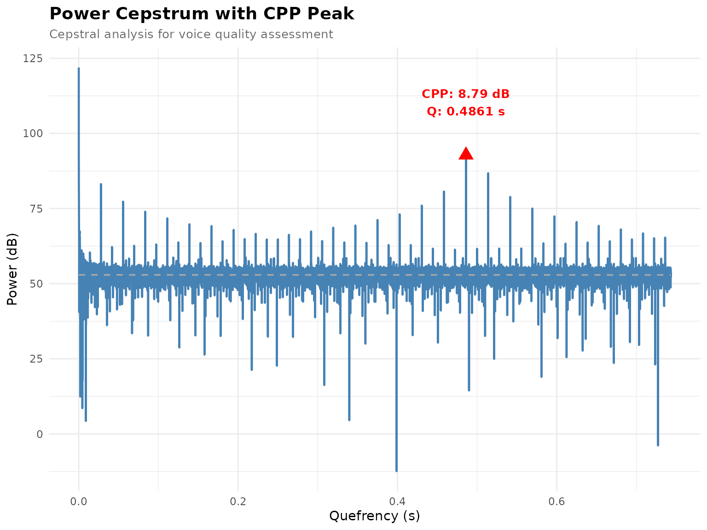

**Parameters**:

- `show_peak` - Highlight the cepstral peak (CPP location)
- `show_trendline` - Display regression line for trend removal
- `fit_method` - Trend line type: “straight”, “exponential decay”, or
  “parabolic”
- `quefrency_range` - X-axis limits (in seconds)
- `db_range` - Y-axis limits (in dB)
- `theme` - ggplot2 theme: “minimal”, “bw”, or “classic”

### Power Cepstrogram

Time-varying cepstral analysis (heatmap):

``` r

# Create PowerCepstrogram
cepstrogram <- sound$to_powercepstrogram(
  pitch_floor = 60,
  time_step = 0.002,
  maximum_frequency = 5000,
  pre_emphasis_frequency = 50
)

# Heatmap visualization
plot_powercepstrogram(
  cepstrogram,
  quefrency_range = c(0.001, 0.05),
  db_range = c(20, 80),
  color_scale = "viridis"
)
#> Scale for fill is already present.
#> Adding another scale for fill, which will replace the existing scale.
```

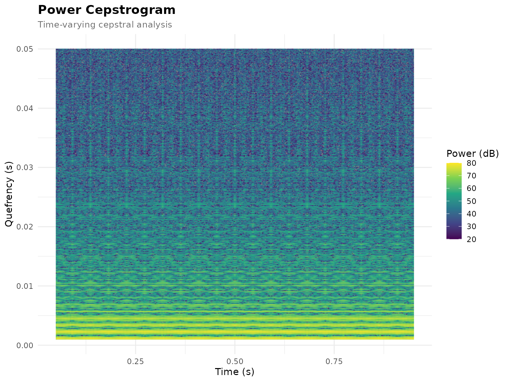

**Color scales** (`color_scale` argument):

- “viridis” (default) - Perceptually uniform, colorblind-friendly
- “magma”, “inferno”, “plasma” - Alternative viridis variants

### CPP Time Series

Track Cepstral Peak Prominence over time:

``` r

# CPP time series with smoothing
plot_cpp_timeseries(
  cepstrogram,
  smooth = TRUE,
  title = "CPP Over Time"
)
#> `geom_smooth()` using formula = 'y ~ x'
```

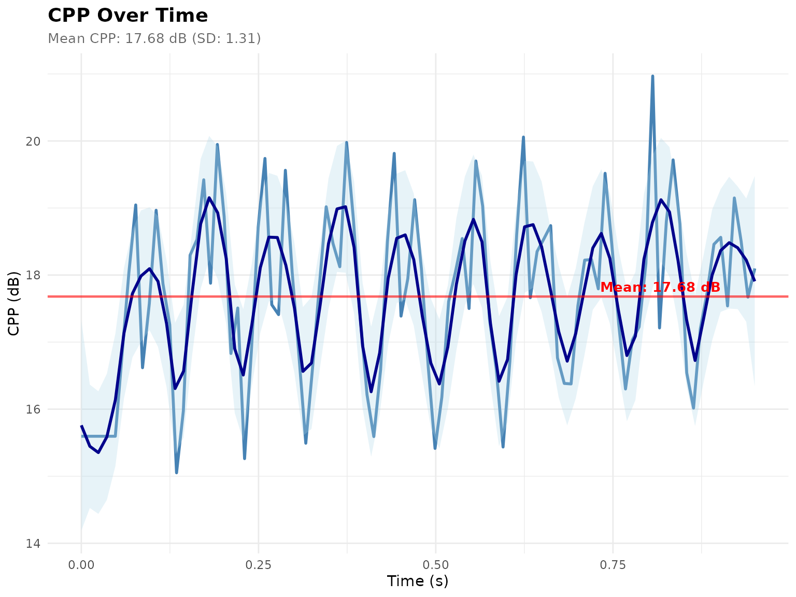

**Features**:

- CPP values sampled across the cepstrogram’s time range
- Optional loess smoothing (`smooth = TRUE`)
- Mean CPP reference line (always drawn)
- Optional horizontal reference lines (`reference_lines` argument)

### Comprehensive Cepstrum Report

Multi-panel diagnostic figure combining all cepstral visualizations:

``` r

# Complete cepstral analysis report (power cepstrum + cepstrogram + CPP time series)
report_plot <- create_cepstrum_report(cepstrogram = cepstrogram)
```

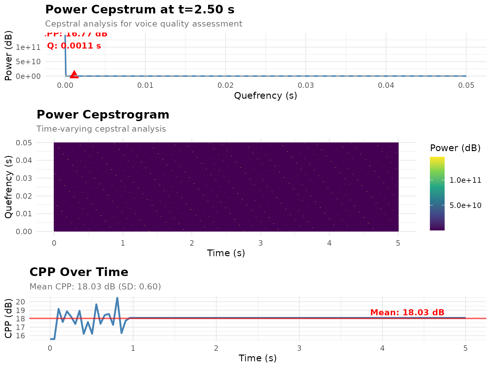

``` r


ggsave(file.path(tempdir(), "cepstrum_report.pdf"), report_plot, width = 12, height = 10)
```

**Report panels** (stacked with
[`gridExtra::grid.arrange()`](https://rdrr.io/pkg/gridExtra/man/arrangeGrob.html)):

1.  **PowerCepstrum** at a single time slice - with peak and trendline
2.  **PowerCepstrogram** - time-quefrency heatmap
3.  **CPP Time Series** - CPP values over time

## Formant Visualization

### F1-F2 Formant Space

F1-F2 plots by segment label (the pattern is the same for vowel-only
data; the bundled `test.TextGrid` has phone labels, not exclusively
vowels):

``` r

# Extract formants at the midpoint of each labeled interval on the "phones" tier
sound <- Sound$new(system.file("extdata", "test.wav", package = "pladdrr"))
textgrid <- TextGrid$new(system.file("extdata", "test.TextGrid", package = "pladdrr"))

formant_data <- data.frame(
  vowel = character(),
  F1 = numeric(),
  F2 = numeric(),
  F3 = numeric()
)

tier <- 2  # "phones" tier
formant <- sound$to_formant_burg()
n_intervals <- textgrid$get_number_of_intervals(tier)
for (i in seq_len(n_intervals)) {
  label <- textgrid$get_interval_text(tier, i)
  if (label != "") {
    t_start <- textgrid$get_interval_start_time(tier, i)
    t_end <- textgrid$get_interval_end_time(tier, i)
    t_mid <- (t_start + t_end) / 2

    f1 <- formant$get_value_at_time(1, t_mid, "hertz")
    f2 <- formant$get_value_at_time(2, t_mid, "hertz")
    f3 <- formant$get_value_at_time(3, t_mid, "hertz")

    formant_data <- rbind(formant_data, data.frame(
      vowel = label,
      F1 = f1,
      F2 = f2,
      F3 = f3
    ))
  }
}

# Create vowel space plot
ggplot(formant_data, aes(x = F2, y = F1, color = vowel, label = vowel)) +
  geom_point(size = 4, alpha = 0.7) +
  geom_text(vjust = -1, size = 5) +
  scale_x_reverse() +  # F2 decreases left to right
  scale_y_reverse() +  # F1 decreases bottom to top
  labs(
    title = "Formant Space (F1-F2) by Segment",
    x = "F2 (Hz)",
    y = "F1 (Hz)"
  ) +
  theme_minimal() +
  theme(legend.position = "none")
#> Warning: Removed 4 rows containing missing values or values outside the scale range
#> (`geom_point()`).
#> Warning: Removed 4 rows containing missing values or values outside the scale range
#> (`geom_text()`).
```

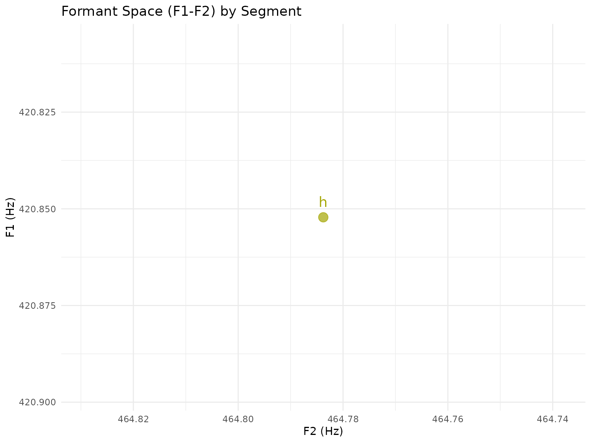

### Formant Trajectories

Visualize formant movement over time:

``` r

# Extract formant tracks
formant <- sound$to_formant_burg(
  time_step = 0.01,
  max_number_of_formants = 5,
  maximum_formant = 5500
)

# as_data_frame() returns long format: one row per (time, formant number).
# Keep F1-F3 and reshape to wide for a multi-line plot.
formant_df <- formant$as_data_frame()
formant_df <- formant_df[formant_df$formant <= 3, ]
formant_wide <- data.table::dcast(formant_df, time ~ formant, value.var = "frequency")
data.table::setnames(formant_wide, c("1", "2", "3"), c("F1", "F2", "F3"))

# Plot F1-F3 over time
ggplot(formant_wide, aes(x = time)) +
  geom_line(aes(y = F1, color = "F1"), linewidth = 1) +
  geom_line(aes(y = F2, color = "F2"), linewidth = 1) +
  geom_line(aes(y = F3, color = "F3"), linewidth = 1) +
  scale_color_manual(
    name = "Formant",
    values = c("F1" = "#E41A1C", "F2" = "#377EB8", "F3" = "#4DAF4A")
  ) +
  labs(
    title = "Formant Trajectories",
    x = "Time (s)",
    y = "Frequency (Hz)"
  ) +
  theme_minimal()
```

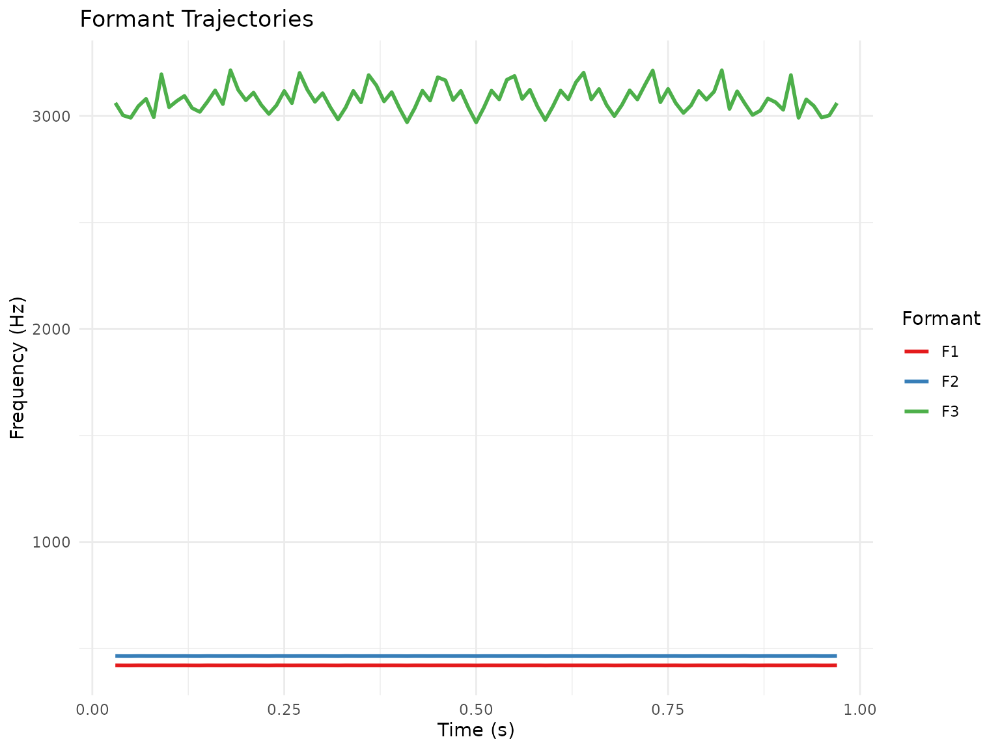

`autoplot(formant)` and `ggplot() + autolayer(formant)` provide the same
F1-F3 trajectory plot without manual reshaping.

## Pitch and Intensity Visualization

### Pitch Contour

``` r

# Extract pitch
sound <- Sound$new(system.file("extdata", "test.wav", package = "pladdrr"))
pitch <- sound$to_pitch()

# Convert to data frame
pitch_df <- pitch$as_data_frame()

# Plot pitch contour
ggplot(pitch_df, aes(x = time, y = frequency)) +
  geom_line(color = "#1f77b4", linewidth = 0.8) +
  geom_point(color = "#1f77b4", size = 1, alpha = 0.5) +
  labs(
    title = "Fundamental Frequency (F0) Contour",
    x = "Time (s)",
    y = "Frequency (Hz)"
  ) +
  theme_minimal()
```

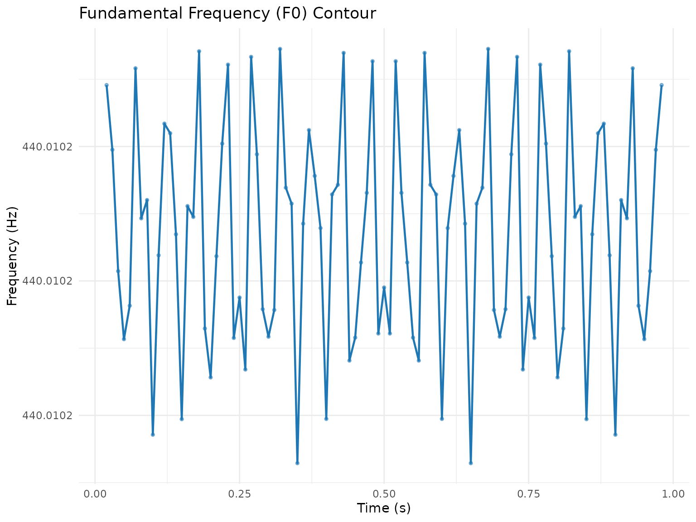

### Intensity Contour

``` r

# Extract intensity
intensity <- sound$to_intensity()

# Convert to data frame
intensity_df <- intensity$as_data_frame()

# Plot intensity contour
ggplot(intensity_df, aes(x = time, y = intensity_db)) +
  geom_line(color = "#ff7f0e", linewidth = 0.8) +
  geom_area(fill = "#ff7f0e", alpha = 0.3) +
  labs(
    title = "Intensity Contour",
    x = "Time (s)",
    y = "Intensity (dB)"
  ) +
  theme_minimal()
```

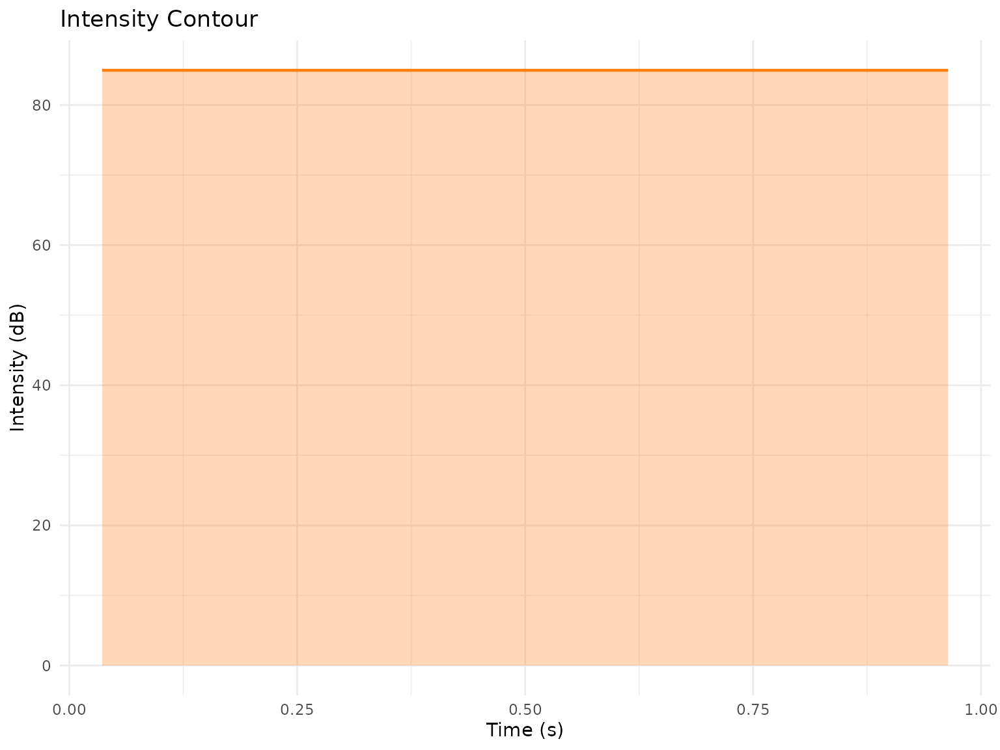

### Combined Pitch and Intensity

Pitch and intensity are extracted on different time grids, so intensity
is interpolated onto the pitch time points with
[`stats::approx()`](https://rdrr.io/r/stats/approxfun.html) before
plotting:

``` r

combined <- data.frame(
  time = pitch_df$time,
  frequency = pitch_df$frequency,
  intensity_db = approx(intensity_df$time, intensity_df$intensity_db,
                         xout = pitch_df$time)$y
)

# Dual-axis plot
ggplot(combined, aes(x = time)) +
  geom_line(aes(y = frequency, color = "F0"), linewidth = 0.8) +
  geom_line(aes(y = intensity_db * 3, color = "Intensity"), linewidth = 0.8) +
  scale_y_continuous(
    name = "Frequency (Hz)",
    sec.axis = sec_axis(~./3, name = "Intensity (dB)")
  ) +
  scale_color_manual(
    name = "",
    values = c("F0" = "#1f77b4", "Intensity" = "#ff7f0e")
  ) +
  labs(
    title = "Pitch and Intensity",
    x = "Time (s)"
  ) +
  theme_minimal() +
  theme(legend.position = "top")
#> Warning: Removed 4 rows containing missing values or values outside the scale range
#> (`geom_line()`).
```

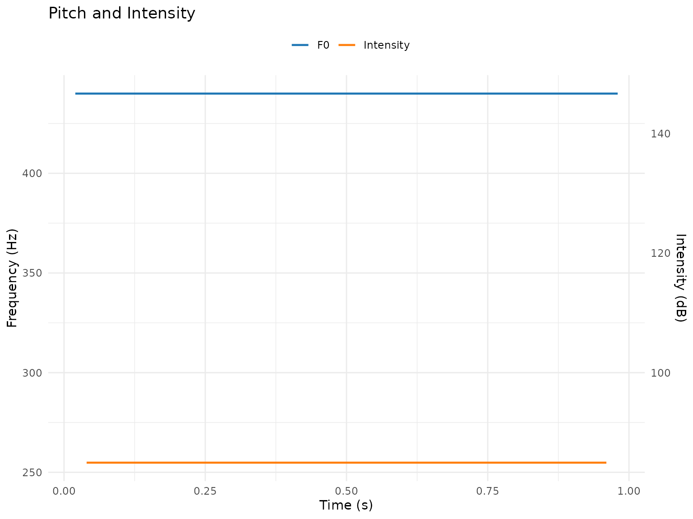

## TextGrid Visualization

`pladdrr` provides
[`autoplot.TextGrid()`](https://humlab-speech.github.io/pladdrr/reference/autoplot-methods.md)
and
[`autolayer.TextGrid()`](https://humlab-speech.github.io/pladdrr/reference/autoplot-methods.md)
methods, so plotting a tier does not require manually looping over
intervals and building
[`geom_rect()`](https://ggplot2.tidyverse.org/reference/geom_tile.html)/[`geom_text()`](https://ggplot2.tidyverse.org/reference/geom_text.html)
calls.

### Annotation Tier Display

``` r

# Load TextGrid
tg <- TextGrid$new(system.file("extdata", "test.TextGrid", package = "pladdrr"))

# autoplot() draws the whole TextGrid (all tiers stacked), delegating to the
# base plot.TextGrid() method
autoplot(tg)
```

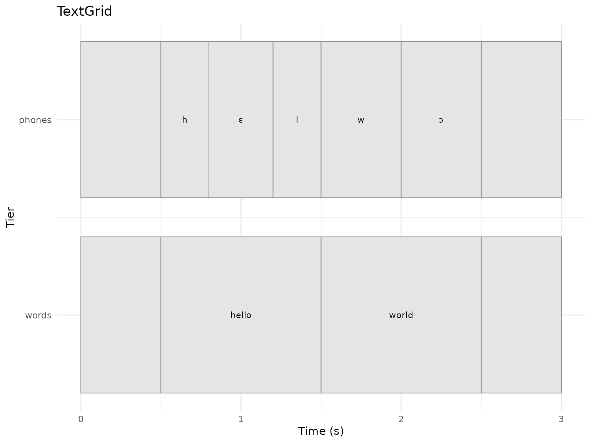

``` r


# autolayer() returns a list of geoms for a single tier, for use inside a
# ggplot2 pipeline (e.g. layered over a Sound waveform or spectrogram)
ggplot() +
  autolayer(tg, tier = "words", color = "steelblue") +
  labs(title = "Word Tier", x = "Time (s)", y = "") +
  theme_minimal()
```

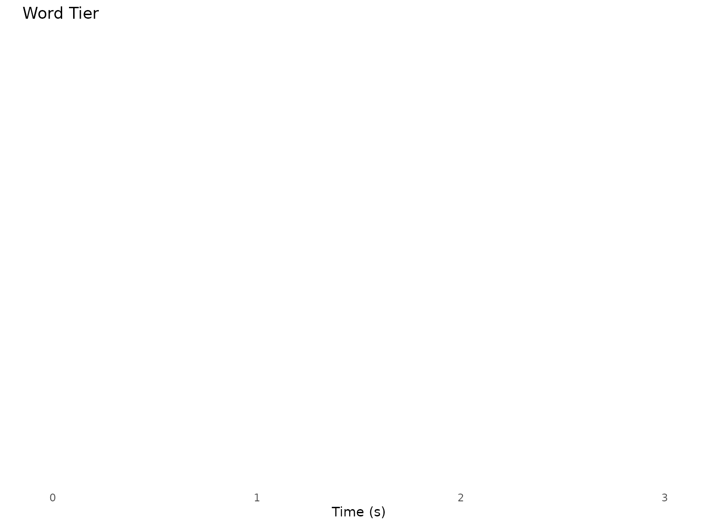

``` r


ggplot() +
  autolayer(tg, tier = "phones", color = "darkgreen", alpha = 0.4) +
  labs(title = "Phone Tier", x = "Time (s)", y = "") +
  theme_minimal()
```

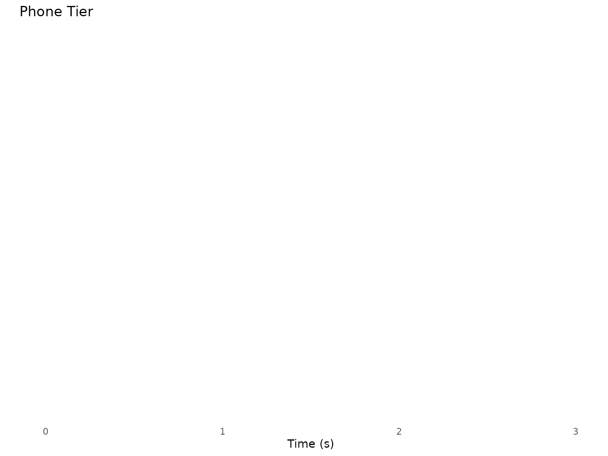

### Duration Analysis

``` r

# Interval durations for the "phones" tier, via get_all_intervals()
tier_data <- tg$get_all_intervals("phones")
tier_data$duration <- tier_data$end - tier_data$start

# Filter out empty (unlabeled) intervals
tier_data_labeled <- tier_data[tier_data$text != "", ]

# Duration histogram by label
ggplot(tier_data_labeled, aes(x = duration, fill = text)) +
  geom_histogram(bins = 10, alpha = 0.7, color = "black") +
  facet_wrap(~text, scales = "free_y") +
  labs(
    title = "Interval Duration Distribution",
    x = "Duration (s)",
    y = "Count"
  ) +
  theme_minimal() +
  theme(legend.position = "none")
```

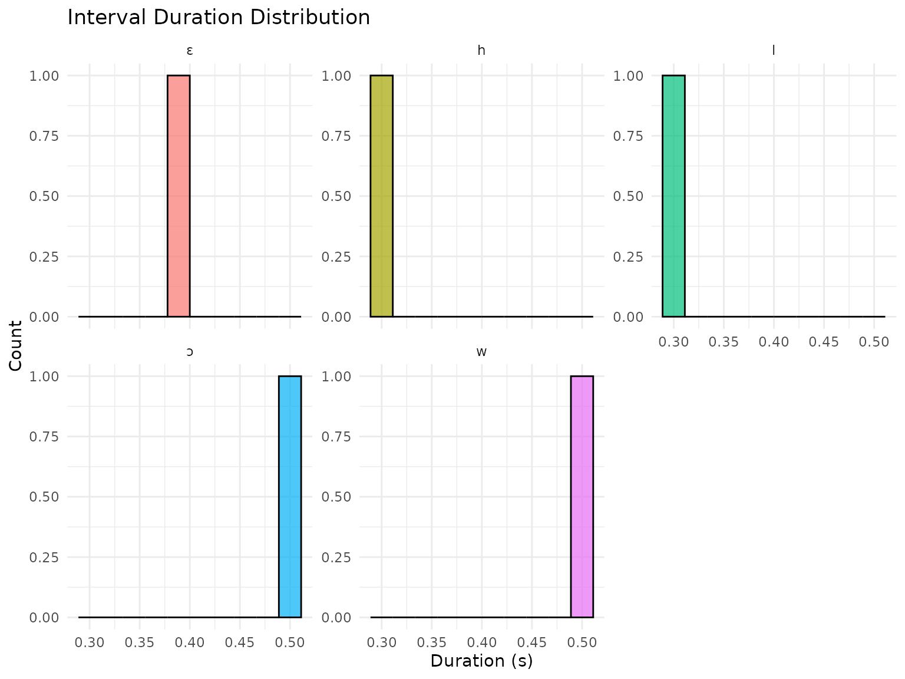

## Spectral Visualization

### Spectrogram

``` r

# Create spectrogram
sound <- Sound$new(system.file("extdata", "test.wav", package = "pladdrr"))
spectrogram <- sound$to_spectrogram(
  window_length = 0.005,
  max_frequency = 5000,
  time_step = 0.002,
  frequency_step = 20,
  window_shape = "Gaussian"
)

# Convert to matrix for plotting (rows = frequency, columns = time)
spec_matrix <- spectrogram$as_matrix()
time_vec <- seq(0, sound$get_total_duration(), length.out = ncol(spec_matrix))
freq_vec <- seq(0, 5000, length.out = nrow(spec_matrix))

# Long-format data frame for ggplot2 (base R, no reshape dependency)
spec_long <- expand.grid(time = time_vec, frequency = freq_vec)
spec_long$power <- as.vector(t(spec_matrix))

# Plot spectrogram
ggplot(spec_long, aes(x = time, y = frequency, fill = power)) +
  geom_tile() +
  scale_fill_viridis_c(option = "magma", name = "Power (dB)") +
  labs(
    title = "Spectrogram",
    x = "Time (s)",
    y = "Frequency (Hz)"
  ) +
  theme_minimal()
```

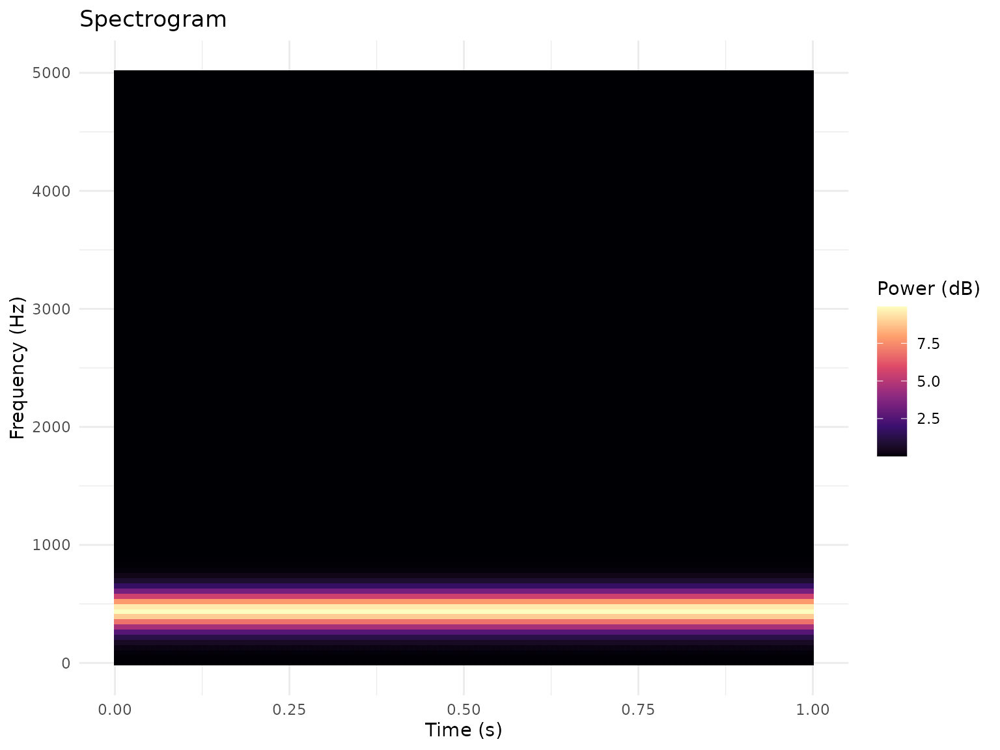

### Spectrum

``` r

# Create spectrum from sound
spectrum <- sound$to_spectrum(fast = TRUE)

# Convert to data frame
spectrum_df <- spectrum$as_data_frame()

# Plot spectrum
ggplot(spectrum_df, aes(x = frequency, y = power)) +
  geom_line(color = "#2ca02c", linewidth = 0.8) +
  labs(
    title = "Power Spectrum",
    x = "Frequency (Hz)",
    y = "Power (dB)"
  ) +
  theme_minimal()
```

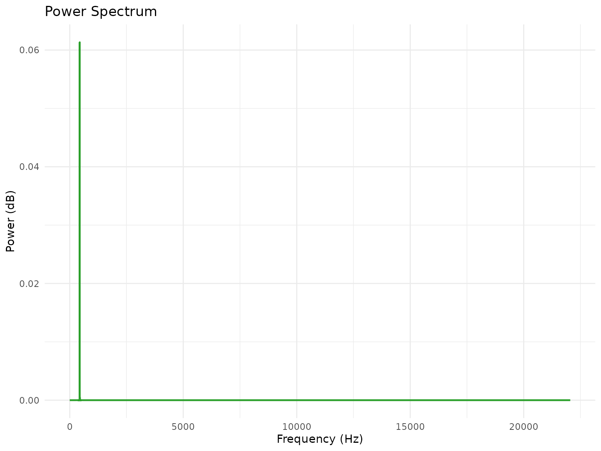

### Long-Term Average Spectrum (LTAS)

``` r

# Create LTAS
ltas <- sound$to_ltas(bandwidth = 100)

# Convert to data frame
ltas_df <- ltas$as_data_frame()

# Plot LTAS
ggplot(ltas_df, aes(x = frequency, y = power_db)) +
  geom_line(color = "#d62728", linewidth = 0.8) +
  geom_area(fill = "#d62728", alpha = 0.3) +
  labs(
    title = "Long-Term Average Spectrum",
    x = "Frequency (Hz)",
    y = "Power (dB)"
  ) +
  theme_minimal()
```

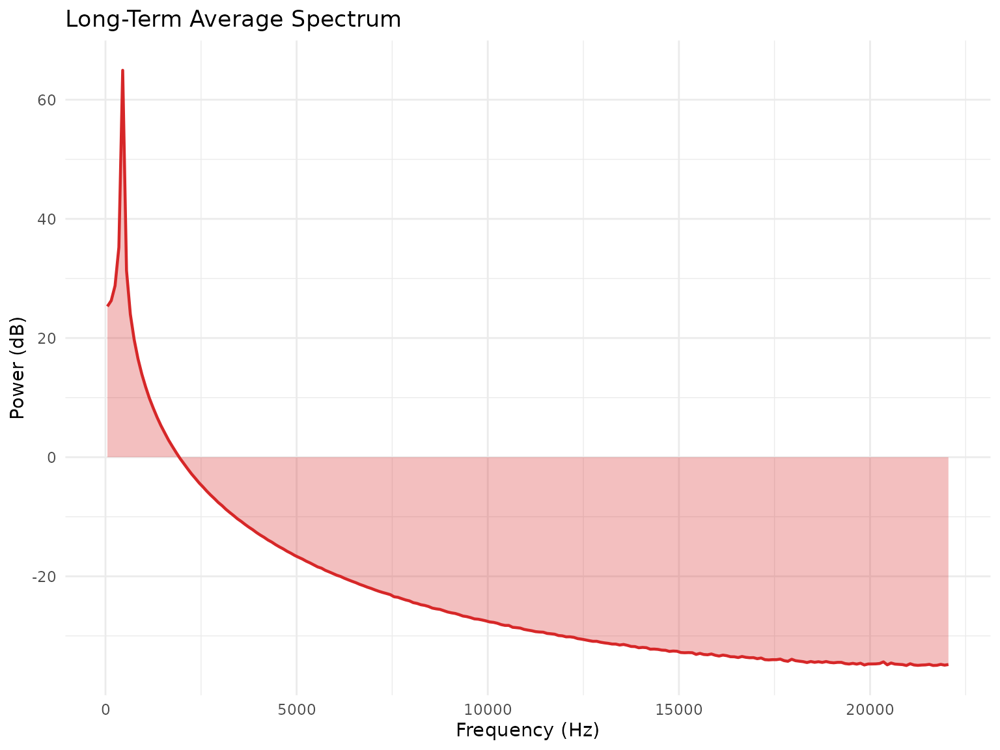

## Customization and Theming

### Custom Color Schemes

``` r

# Define custom color palette
my_colors <- c(
  "#E69F00",  # Orange
  "#56B4E9",  # Sky Blue
  "#009E73",  # Green
  "#F0E442",  # Yellow
  "#0072B2",  # Blue
  "#D55E00",  # Vermillion
  "#CC79A7"   # Purple
)

# Apply to vowel space plot
ggplot(formant_data, aes(x = F2, y = F1, color = vowel)) +
  geom_point(size = 4) +
  scale_color_manual(values = my_colors) +
  scale_x_reverse() +
  scale_y_reverse() +
  theme_minimal()
#> Warning: Removed 4 rows containing missing values or values outside the scale range
#> (`geom_point()`).
```

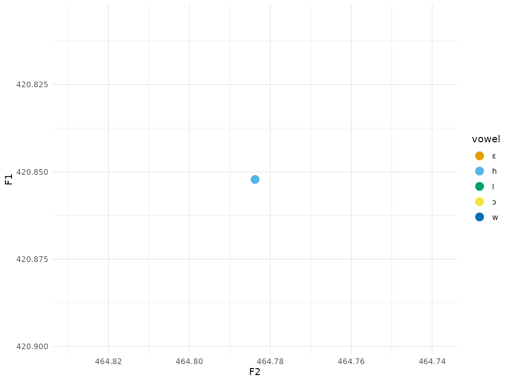

### Publication Themes

``` r

# Black and white theme for journals
ggplot(pitch_df, aes(x = time, y = frequency)) +
  geom_line() +
  labs(
    title = "Fundamental Frequency",
    x = "Time (s)",
    y = "F0 (Hz)"
  ) +
  theme_bw() +
  theme(
    panel.grid.minor = element_blank(),
    text = element_text(size = 12, family = "serif")
  )
```

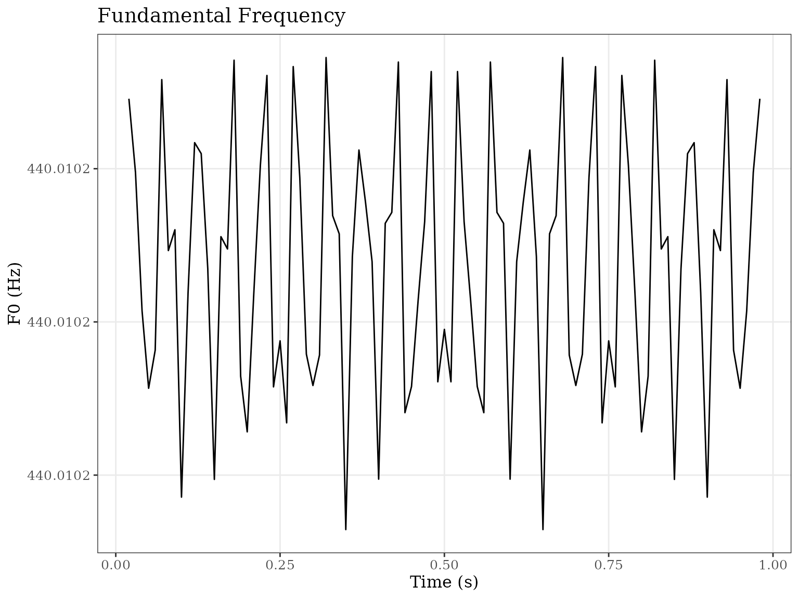

### Multi-Panel Figures

``` r

library(gridExtra)

# Create individual plots
p1 <- ggplot(pitch_df, aes(x = time, y = frequency)) +
  geom_line() +
  labs(title = "Pitch", x = "Time (s)", y = "F0 (Hz)") +
  theme_minimal()

p2 <- ggplot(intensity_df, aes(x = time, y = intensity_db)) +
  geom_line() +
  labs(title = "Intensity", x = "Time (s)", y = "dB") +
  theme_minimal()

p3 <- ggplot(formant_wide, aes(x = time)) +
  geom_line(aes(y = F1, color = "F1")) +
  geom_line(aes(y = F2, color = "F2")) +
  labs(title = "Formants", x = "Time (s)", y = "Hz") +
  theme_minimal()

# Arrange in grid
grid.arrange(p1, p2, p3, nrow = 3)
```

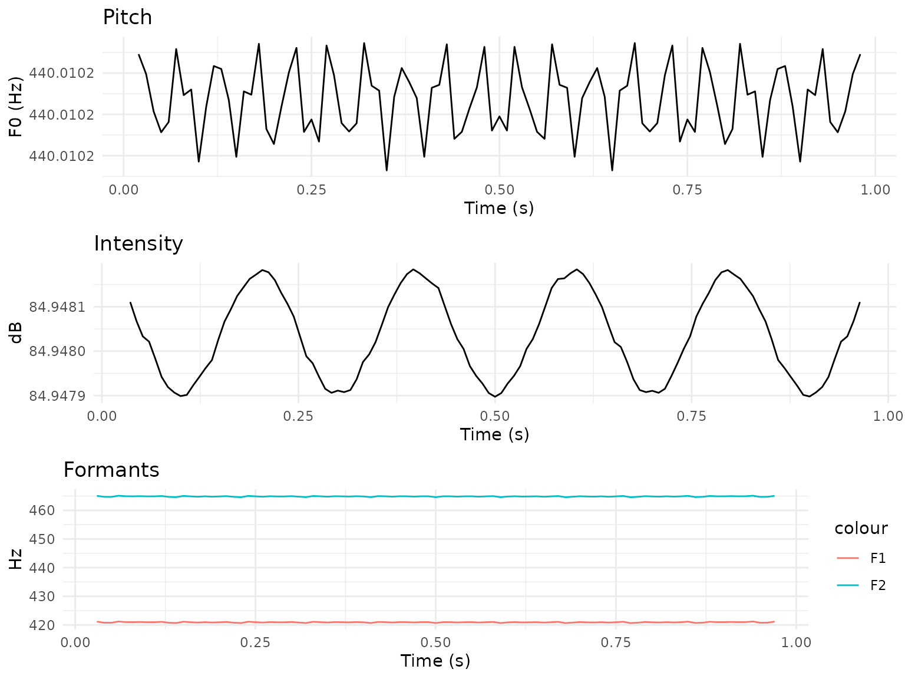

## Saving Plots

### High-Resolution Output

``` r

# Save as PDF (vector graphics)
ggsave("figure1.pdf", plot = p1, width = 8, height = 6, units = "in")

# Save as PNG (high DPI)
ggsave("figure1.png", plot = p1, width = 8, height = 6, dpi = 300)

# Save as SVG (editable vector)
ggsave("figure1.svg", plot = p1, width = 8, height = 6)

# Save as TIFF (for journals)
ggsave("figure1.tiff", plot = p1, width = 8, height = 6, dpi = 300, compression = "lzw")
```

### Batch Saving

``` r

# List of plots
plots <- list(pitch = p1, intensity = p2, formants = p3)

# Save all plots
for (name in names(plots)) {
  ggsave(
    filename = paste0("figure_", name, ".pdf"),
    plot = plots[[name]],
    width = 8,
    height = 6
  )
}
```

## Summary

This vignette covered:

- **Cepstral analysis**:
  [`plot_powercepstrum()`](https://humlab-speech.github.io/pladdrr/reference/plot_powercepstrum.md),
  [`plot_powercepstrogram()`](https://humlab-speech.github.io/pladdrr/reference/plot_powercepstrogram.md),
  [`plot_cpp_timeseries()`](https://humlab-speech.github.io/pladdrr/reference/plot_cpp_timeseries.md),
  [`create_cepstrum_report()`](https://humlab-speech.github.io/pladdrr/reference/create_cepstrum_report.md)
- **Formant analysis**: F1-F2 formant space and F1-F3 trajectories from
  `Formant$as_data_frame()`
- **Prosodic features**: pitch and intensity contours from
  `Pitch$as_data_frame()` and `Intensity$as_data_frame()`
- **Annotation**: TextGrid tier display via
  [`autoplot.TextGrid()`](https://humlab-speech.github.io/pladdrr/reference/autoplot-methods.md)
  and
  [`autolayer.TextGrid()`](https://humlab-speech.github.io/pladdrr/reference/autoplot-methods.md)
- **Spectral analysis**: spectrograms, spectra, and LTAS from the
  corresponding
  `as_matrix()`/[`as_data_frame()`](https://tibble.tidyverse.org/reference/deprecated.html)
  methods

All examples produce ordinary `ggplot2` objects that can be themed,
combined with
[`gridExtra::grid.arrange()`](https://rdrr.io/pkg/gridExtra/man/arrangeGrob.html),
and saved with
[`ggsave()`](https://ggplot2.tidyverse.org/reference/ggsave.html).

For more information on specific acoustic analyses, see:

- [`vignette("getting-started")`](https://humlab-speech.github.io/pladdrr/articles/getting-started.md) -
  Basic workflow
- [`vignette("integrated-phonetic-analysis")`](https://humlab-speech.github.io/pladdrr/articles/integrated-phonetic-analysis.md) -
  Multi-parameter analysis
- [`vignette("textgrid-workflows")`](https://humlab-speech.github.io/pladdrr/articles/textgrid-workflows.md) -
  Annotation-based analysis
- [`vignette("autoplot-autolayer")`](https://humlab-speech.github.io/pladdrr/articles/autoplot-autolayer.md) -
  Full reference for the `autoplot`/`autolayer` methods
