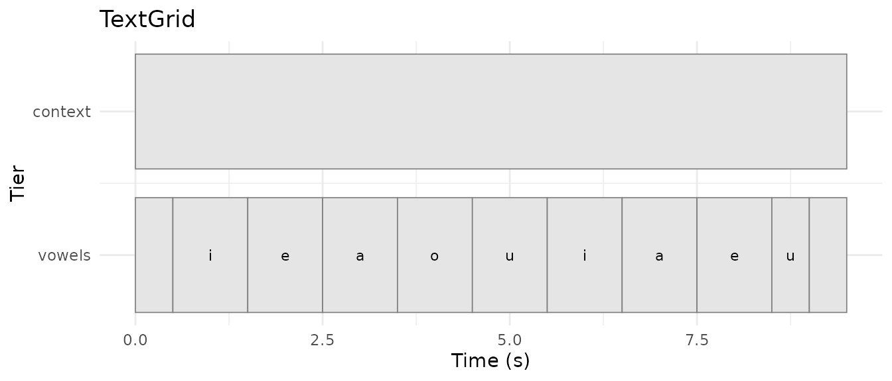
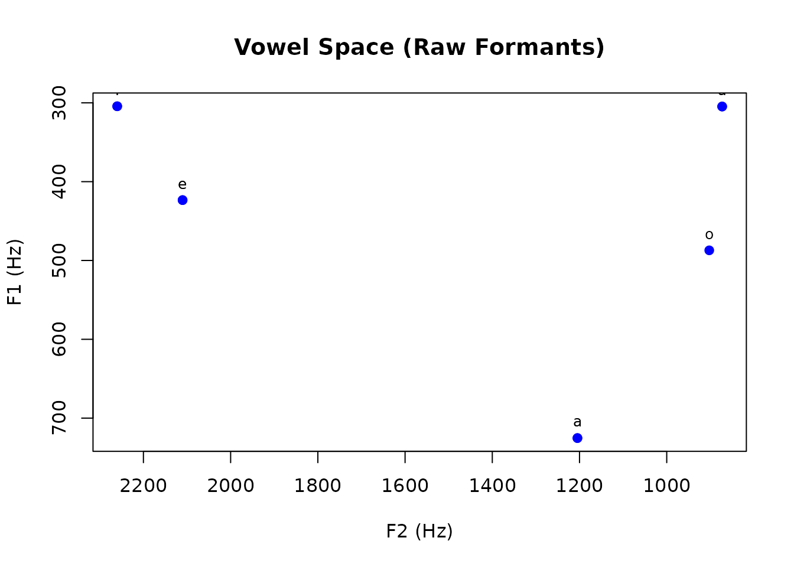
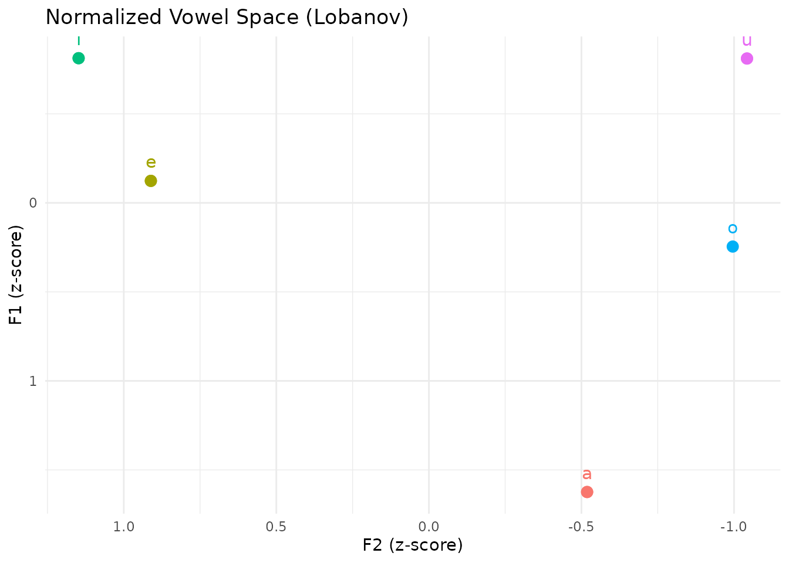
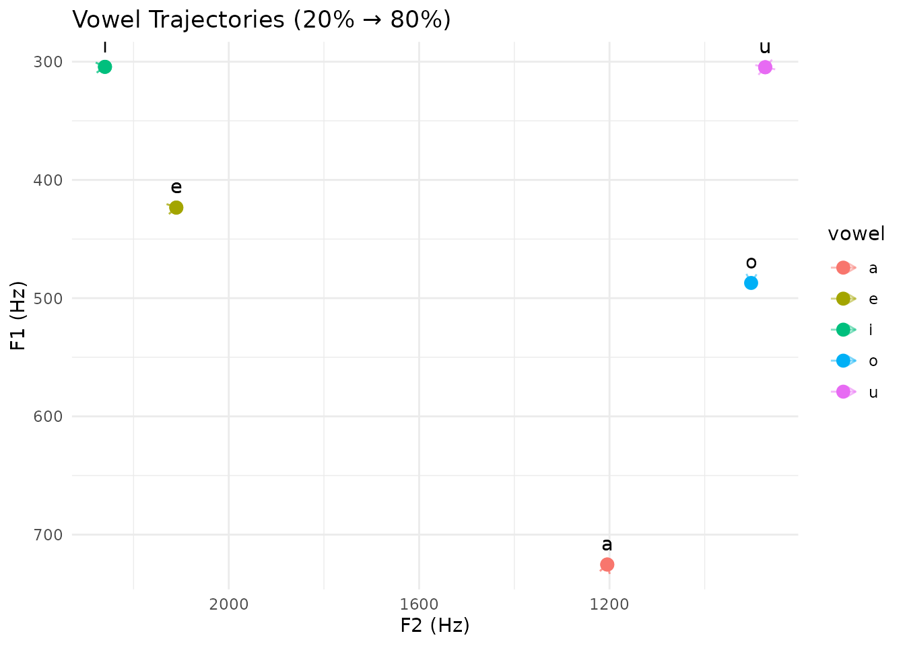
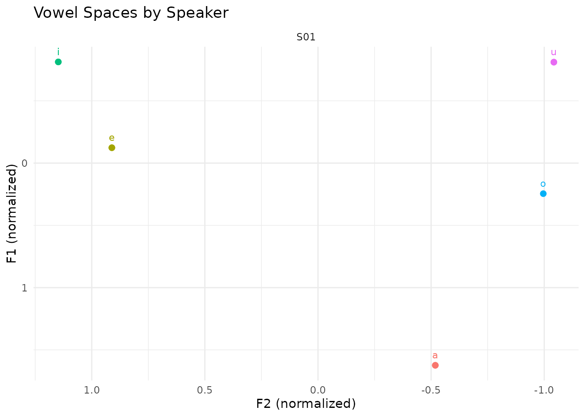

# Vowel Space Analysis with pladdrr

## Overview

This vignette demonstrates a vowel acoustics research workflow using the
**pladdrr** package. Topics covered:

- **Formant extraction** with optimal parameters
- **Multi-point measurements** (onset, midpoint, offset)
- **Formant normalization** (Lobanov z-score method)
- **Vowel space statistics** and area calculations
- **F1-F2 plotting** preparation
- **Integration with ggplot2** for publication-quality graphics

This workflow is used in sociolinguistic variation studies, L2
acquisition research, and dialectology.

**Note:** For comprehensive visualization examples including additional
plot types (spectrograms, voice quality reports, cepstral analysis), see
[`vignette("visualization")`](https://humlab-speech.github.io/pladdrr/articles/visualization.md).

## Background

### Vowel Acoustics

Vowels are characterized acoustically by their **formants** - resonance
frequencies of the vocal tract:

- **F1** (First formant): Correlates with tongue height (inverse)
  - High vowels (i, u): Low F1 (~280-300 Hz)
  - Low vowels (a): High F1 (~700 Hz)
- **F2** (Second formant): Correlates with tongue backness (inverse)
  - Front vowels (i, e): High F2 (~2000-2250 Hz)
  - Back vowels (u, o): Low F2 (~800-900 Hz)
- **F3** (Third formant): Useful for rhoticity and speaker normalization

### The F1-F2 Vowel Space

Vowels are visualized in **acoustic space**:

- X-axis: F2 (typically reversed, high values on left)
- Y-axis: F1 (typically reversed, low values at top)
- This mirrors the articulatory vowel quadrilateral

### Formant Normalization

Speaker-intrinsic differences (vocal tract length, physiology) require
normalization for comparison:

- **Lobanov z-scores**: Standardize formants within speaker
  - z = (F - mean_F) / sd_F
  - Mean-centers and scales to unit variance
  - Preserves vowel space structure
- Other methods: Bark difference, Nearey, Watt & Fabricius

## Part 1: Data Preparation

### Loading Audio and Annotations

For this demonstration we synthesize each vowel token with
[`klattgrid_create_from_vowel()`](https://humlab-speech.github.io/pladdrr/reference/klattgrid_create_from_vowel.md),
using typical American English formant targets, rather than loading a
recording. In real research, load an actual recording with
`Sound$new("path/to/recording.wav")` and its annotation with
`TextGrid$new("path/to/recording.TextGrid")`. The package ships one
example pair for experimentation:
`system.file("extdata", "test.wav", package = "pladdrr")` and
`system.file("extdata", "test.TextGrid", package = "pladdrr")`.

``` r

library(pladdrr)
#> pladdrr: direct access to Praat's core algorithms from R.
#> See ?pladdrr for an overview, or citation("pladdrr") for citation details.
library(ggplot2)

sampling_rate <- 44100

# Define vowel segments (start, end, label, word context)
vowel_segments <- data.frame(
  start = c(0.5, 1.5, 2.5, 3.5, 4.5, 5.5, 6.5, 7.5, 8.5),
  end = c(1.0, 2.0, 3.0, 4.0, 5.0, 6.0, 7.0, 8.0, 9.0),
  vowel = c("i", "e", "a", "o", "u", "i", "a", "e", "u"),
  word = c("beet", "bait", "bat", "boat", "boot", "beat", "father", "bet", "boot"),
  stringsAsFactors = FALSE
)

# Approximate formant targets (Hz) used only to synthesize distinguishable
# demonstration tokens
vowel_targets <- list(
  i = c(f1 = 280, f2 = 2250, f3 = 3000),
  e = c(f1 = 400, f2 = 2100, f3 = 2700),
  a = c(f1 = 700, f2 = 1200, f3 = 2600),
  o = c(f1 = 500, f2 =  900, f3 = 2600),
  u = c(f1 = 300, f2 =  850, f3 = 2500)
)

make_silence <- function(duration) {
  Sound$from_values(rep(0, round(duration * sampling_rate)), sampling_rate = sampling_rate)
}

# Build a single Sound by concatenating silence and synthesized vowels so
# that the segment times in vowel_segments line up with the audio
parts <- list(make_silence(vowel_segments$start[1]))
for (i in seq_len(nrow(vowel_segments))) {
  target <- vowel_targets[[vowel_segments$vowel[i]]]
  duration <- vowel_segments$end[i] - vowel_segments$start[i]
  kg <- klattgrid_create_from_vowel(
    duration = duration, f0start = 150,
    f1 = unname(target["f1"]), b1 = 50,
    f2 = unname(target["f2"]), b2 = 100,
    f3 = unname(target["f3"]), b3 = 150
  )
  parts[[length(parts) + 1]] <- kg$to_sound()

  gap <- if (i < nrow(vowel_segments)) {
    vowel_segments$start[i + 1] - vowel_segments$end[i]
  } else {
    0.5
  }
  parts[[length(parts) + 1]] <- make_silence(gap)
}

sound <- parts[[1]]
for (i in 2:length(parts)) {
  sound <- sound$concatenate(parts[[i]])
}

# Create TextGrid with vowel annotations
tg <- TextGrid$create(
  tmin = 0,
  tmax = sound$get_total_duration(),
  tier_names = "vowels context",
  point_tiers = ""  # Both are interval tiers
)

# Add boundaries and labels
for (i in 1:nrow(vowel_segments)) {
  tg$insert_boundary(1, vowel_segments$start[i])
}
tg$insert_boundary(1, vowel_segments$end[nrow(vowel_segments)])

for (i in 1:nrow(vowel_segments)) {
  tg$set_interval_text(1, i + 1, vowel_segments$vowel[i])
}

cat("Prepared", nrow(vowel_segments), "vowel tokens\n")
#> Prepared 9 vowel tokens
```

The
[`autoplot()`](https://ggplot2.tidyverse.org/reference/autoplot.html)/[`autolayer()`](https://ggplot2.tidyverse.org/reference/autolayer.html)
methods for `TextGrid` (see
[`vignette("autoplot-autolayer")`](https://humlab-speech.github.io/pladdrr/articles/autoplot-autolayer.md))
give a quick view of the annotation tier:

``` r

autoplot(tg)
```



## Part 2: Formant Extraction

### Choosing Analysis Parameters

Formant analysis parameters must match speaker characteristics:

``` r

# Parameter guidelines:
# Adult male: max_formant = 5000 Hz
# Adult female: max_formant = 5500 Hz  
# Child: max_formant = 8000 Hz

# For this example (adult female):
max_formant <- 5500
time_step <- 0.01
window_length <- 0.025
pre_emphasis <- 50
```

### Pre-emphasis

Apply pre-emphasis to boost higher frequencies before formant analysis:

``` r

# Note: pre_emphasize modifies sound in-place, so we skip for demonstration
# sound$pre_emphasize(from_frequency = pre_emphasis)
```

### Extract Formants

Use Burg’s algorithm (Praat’s default):

``` r

# Extract formants from the original sound
formant <- sound$to_formant_burg(
  time_step = time_step,
  max_formants = 5,
  max_frequency = max_formant,
  window_length = window_length,
  pre_emphasis_from = pre_emphasis
)

cat("Formant object created\n")
#> Formant object created
cat("Time step:", time_step, "s\n")
#> Time step: 0.01 s
cat("Maximum formant:", max_formant, "Hz\n")
#> Maximum formant: 5500 Hz
```

## Part 3: Multi-Point Measurements

Measure formants at **three time points** per vowel:

- **20%** into vowel (onset, after coarticulation)
- **50%** (midpoint, most stable)
- **80%** (offset, before coarticulation)

This captures vowel trajectories and diphthongization.

``` r

# Initialize results data frame
vowel_features <- data.frame(
  vowel = character(),
  word = character(),
  start = numeric(),
  end = numeric(),
  duration = numeric(),
  f1_20 = numeric(),
  f2_20 = numeric(),
  f3_20 = numeric(),
  f1_50 = numeric(),
  f2_50 = numeric(),
  f3_50 = numeric(),
  f1_80 = numeric(),
  f2_80 = numeric(),
  f3_80 = numeric(),
  stringsAsFactors = FALSE
)

# Measure formants for each vowel
for (i in 1:nrow(vowel_segments)) {
  start <- vowel_segments$start[i]
  end <- vowel_segments$end[i]
  duration <- end - start
  
  # Calculate time points
  t_20 <- start + 0.20 * duration
  t_50 <- start + 0.50 * duration
  t_80 <- start + 0.80 * duration
  
  # Measure formants at each time point
  measure_formants <- function(time) {
    c(
      f1 = formant$get_value_at_time(1, time, "hertz"),
      f2 = formant$get_value_at_time(2, time, "hertz"),
      f3 = formant$get_value_at_time(3, time, "hertz")
    )
  }
  
  f_20 <- measure_formants(t_20)
  f_50 <- measure_formants(t_50)
  f_80 <- measure_formants(t_80)
  
  # Add to results
  vowel_features <- rbind(vowel_features, data.frame(
    vowel = vowel_segments$vowel[i],
    word = vowel_segments$word[i],
    start = start,
    end = end,
    duration = duration,
    f1_20 = f_20["f1"],
    f2_20 = f_20["f2"],
    f3_20 = f_20["f3"],
    f1_50 = f_50["f1"],
    f2_50 = f_50["f2"],
    f3_50 = f_50["f3"],
    f1_80 = f_80["f1"],
    f2_80 = f_80["f2"],
    f3_80 = f_80["f3"]
  ))
}

print(vowel_features)
#>     vowel   word start end duration    f1_20     f2_20    f3_20    f1_50
#> f1      i   beet   0.5   1      0.5 304.2825 2260.0171 3035.761 304.3400
#> f11     e   bait   1.5   2      0.5 422.9372 2110.0704 2731.320 423.3906
#> f12     a    bat   2.5   3      0.5 724.9220 1204.7395 2631.500 725.2976
#> f13     o   boat   3.5   4      0.5 487.1170  902.4938 2632.282 487.1288
#> f14     u   boot   4.5   5      0.5 304.6455  872.8370 2543.082 304.6590
#> f15     i   beat   5.5   6      0.5 304.2825 2260.0155 3035.757 304.3400
#> f16     a father   6.5   7      0.5 724.9210 1204.7388 2631.495 725.2969
#> f17     e    bet   7.5   8      0.5 422.9372 2110.0697 2731.318 423.3905
#> f18     u   boot   8.5   9      0.5 304.6464  872.8440 2543.122 304.6596
#>         f2_50    f3_50    f1_80     f2_80    f3_80
#> f1  2260.0977 3035.876 304.2825 2260.0168 3035.760
#> f11 2110.1787 2731.423 422.9370 2110.0681 2731.315
#> f12 1204.7535 2631.590 724.9211 1204.7389 2631.495
#> f13  902.4855 2632.370 487.1180  902.4939 2632.290
#> f14  872.8936 2543.196 304.6456  872.8379 2543.087
#> f15 2260.0961 3035.872 304.2825 2260.0151 3035.756
#> f16 1204.7529 2631.586 724.9207 1204.7385 2631.493
#> f17 2110.1779 2731.421 422.9369 2110.0674 2731.313
#> f18  872.8984 2543.223 304.6459  872.8406 2543.102
```

## Part 4: Formant Normalization

### Lobanov Z-Score Method

Normalize formants to remove speaker-specific variation:

``` r

# Function to compute Lobanov z-scores
lobanov_normalize <- function(formant_values) {
  (formant_values - mean(formant_values, na.rm = TRUE)) / 
    sd(formant_values, na.rm = TRUE)
}

# Normalize F1 and F2 at midpoint (50%)
vowel_features$f1_norm <- lobanov_normalize(vowel_features$f1_50)
vowel_features$f2_norm <- lobanov_normalize(vowel_features$f2_50)

# Also normalize F3 for completeness
vowel_features$f3_norm <- lobanov_normalize(vowel_features$f3_50)

cat("Applied Lobanov normalization\n")
#> Applied Lobanov normalization
cat("F1_norm: mean =", round(mean(vowel_features$f1_norm), 2), 
    ", SD =", round(sd(vowel_features$f1_norm), 2), "\n")
#> F1_norm: mean = 0 , SD = 1
cat("F2_norm: mean =", round(mean(vowel_features$f2_norm), 2), 
    ", SD =", round(sd(vowel_features$f2_norm), 2), "\n")
#> F2_norm: mean = 0 , SD = 1
```

## Part 5: Vowel Space Statistics

### Descriptive Statistics by Vowel

``` r

# Aggregate by vowel type
vowel_stats <- aggregate(
  cbind(f1_50, f2_50, f1_norm, f2_norm) ~ vowel,
  data = vowel_features,
  FUN = function(x) c(mean = mean(x, na.rm = TRUE), 
                      sd = sd(x, na.rm = TRUE))
)

print(vowel_stats)
#>   vowel   f1_50.mean     f1_50.sd   f2_50.mean     f2_50.sd  f1_norm.mean
#> 1     a 7.252973e+02 5.435158e-04 1.204753e+03 3.880091e-04  1.623955e+00
#> 2     e 4.233906e+02 4.791206e-05 2.110178e+03 4.996400e-04 -1.234687e-01
#> 3     i 3.043400e+02 3.478289e-05 2.260097e+03 1.164839e-03 -8.125284e-01
#> 4     o 4.871288e+02           NA 9.024855e+02           NA  2.454455e-01
#> 5     u 3.046593e+02 4.420004e-04 8.728960e+02 3.378245e-03 -8.106803e-01
#>      f1_norm.sd  f2_norm.mean    f2_norm.sd
#> 1  3.145847e-06 -5.185803e-01  6.127189e-07
#> 2  2.773130e-07  9.112086e-01  7.889993e-07
#> 3  2.013219e-07  1.147950e+00  1.839439e-06
#> 4            NA -9.959020e-01            NA
#> 5  2.558280e-06 -1.042628e+00  5.334706e-06
```

### Vowel Space Area

Calculate vowel space area using the convex hull of F1-F2 points:

``` r

# Use normalized values for comparison across speakers
f1_coords <- vowel_features$f1_norm
f2_coords <- vowel_features$f2_norm

# Compute convex hull
hull_indices <- chull(f2_coords, f1_coords)
hull_points <- cbind(f2_coords[hull_indices], f1_coords[hull_indices])

# Calculate area using shoelace formula
shoelace_area <- function(x, y) {
  n <- length(x)
  area <- 0
  for (i in 1:(n-1)) {
    area <- area + (x[i] * y[i+1] - x[i+1] * y[i])
  }
  area <- area + (x[n] * y[1] - x[1] * y[n])
  abs(area) / 2
}

vowel_space_area <- shoelace_area(hull_points[,1], hull_points[,2])
cat("Vowel space area (normalized):", round(vowel_space_area, 2), "square units\n")
#> Vowel space area (normalized): 3.17 square units
```

Larger vowel space area indicates: - Greater vowel dispersion (clearer
articulation) - Useful for comparing clear vs. casual speech -
Developmental changes (child vs. adult) - Clinical applications
(dysarthria assessment)

## Part 6: Trajectory Analysis

### Detect Diphthongization

Compare onset (20%) and offset (80%) formants:

``` r

# Calculate formant movement
vowel_features$f1_movement <- abs(vowel_features$f1_80 - vowel_features$f1_20)
vowel_features$f2_movement <- abs(vowel_features$f2_80 - vowel_features$f2_20)

# Euclidean distance in F1-F2 space
vowel_features$trajectory_length <- sqrt(
  vowel_features$f1_movement^2 + vowel_features$f2_movement^2
)

# Identify potential diphthongs (large trajectory)
diphthong_threshold <- median(vowel_features$trajectory_length, na.rm = TRUE) * 1.5
potential_diphthongs <- vowel_features$vowel[
  vowel_features$trajectory_length > diphthong_threshold
]

cat("Potential diphthongs (large F1-F2 movement):\n")
#> Potential diphthongs (large F1-F2 movement):
cat(paste(unique(potential_diphthongs), collapse = ", "), "\n")
#> e, u
```

## Part 7: Visualization

### Basic F1-F2 Vowel Plot

``` r

# Using base R graphics
plot(
  vowel_features$f2_50,
  vowel_features$f1_50,
  xlim = rev(range(vowel_features$f2_50, na.rm = TRUE)),  # Reverse F2
  ylim = rev(range(vowel_features$f1_50, na.rm = TRUE)),  # Reverse F1
  xlab = "F2 (Hz)",
  ylab = "F1 (Hz)",
  main = "Vowel Space (Raw Formants)",
  pch = 19,
  col = "blue"
)
text(
  vowel_features$f2_50,
  vowel_features$f1_50,
  labels = vowel_features$vowel,
  pos = 3,
  cex = 0.8
)
```



### Advanced Plotting with ggplot2

``` r

library(ggplot2)

# Normalized vowel space
ggplot(vowel_features, aes(x = f2_norm, y = f1_norm, label = vowel, color = vowel)) +
  geom_point(size = 3) +
  geom_text(vjust = -1, size = 4) +
  scale_x_reverse() +
  scale_y_reverse() +
  labs(
    title = "Normalized Vowel Space (Lobanov)",
    x = "F2 (z-score)",
    y = "F1 (z-score)"
  ) +
  theme_minimal() +
  theme(legend.position = "none")
```



``` r


# With trajectories
ggplot(vowel_features) +
  geom_segment(aes(x = f2_20, y = f1_20, xend = f2_80, yend = f1_80, color = vowel),
               arrow = arrow(length = unit(0.2, "cm")), alpha = 0.5) +
  geom_point(aes(x = f2_50, y = f1_50, color = vowel), size = 3) +
  geom_text(aes(x = f2_50, y = f1_50, label = vowel), vjust = -1) +
  scale_x_reverse() +
  scale_y_reverse() +
  labs(
    title = "Vowel Trajectories (20% -> 80%)",
    x = "F2 (Hz)",
    y = "F1 (Hz)"
  ) +
  theme_minimal()
```



### Faceted by Speaker or Condition

``` r

# With multi-speaker data you would already have a speaker column. The demo
# data above comes from a single synthesised talker, so label it as such to
# show the faceting call working.
vowel_features$speaker <- "S01"

ggplot(vowel_features, aes(x = f2_norm, y = f1_norm, label = vowel, color = vowel)) +
  geom_point(size = 2) +
  geom_text(vjust = -1, size = 3) +
  facet_wrap(~ speaker, ncol = 3) +
  scale_x_reverse() +
  scale_y_reverse() +
  labs(
    title = "Vowel Spaces by Speaker",
    x = "F2 (normalized)",
    y = "F1 (normalized)"
  ) +
  theme_minimal() +
  theme(legend.position = "none")
```



## Part 8: Statistical Analysis

### ANOVA: Vowel Differences

``` r

# Test if vowels differ in F1
f1_model <- aov(f1_50 ~ vowel, data = vowel_features)
summary(f1_model)
#>             Df Sum Sq Mean Sq   F value Pr(>F)    
#> vowel        4 238803   59701 4.831e+11 <2e-16 ***
#> Residuals    4      0       0                     
#> ---
#> Signif. codes:  0 '***' 0.001 '**' 0.01 '*' 0.05 '.' 0.1 ' ' 1

# Post-hoc pairwise comparisons
TukeyHSD(f1_model)
#>   Tukey multiple comparisons of means
#>     95% family-wise confidence level
#> 
#> Fit: aov(formula = f1_50 ~ vowel, data = vowel_features)
#> 
#> $vowel
#>             diff          lwr         upr p adj
#> e-a -301.9067015 -301.9082643 -301.905139     0
#> i-a -420.9572658 -420.9588286 -420.955703     0
#> o-a -238.1684798 -238.1703937 -238.166566     0
#> u-a -420.6379775 -420.6395403 -420.636415     0
#> i-e -119.0505643 -119.0521271 -119.049002     0
#> o-e   63.7382217   63.7363078   63.740136     0
#> u-e -118.7312760 -118.7328388 -118.729713     0
#> o-i  182.7887861  182.7868721  182.790700     0
#> u-i    0.3192883    0.3177256    0.320851     0
#> u-o -182.4694978 -182.4714117 -182.467584     0
```

### Mixed-Effects Models

For multi-speaker data with repeated measures, add a `speaker` column
and fit a random intercept (requires the `lme4` package, not a pladdrr
dependency):

``` r

# Not evaluated here: lme4 is not a pladdrr dependency, and a random intercept
# needs genuine repeated measures across several speakers, which the synthetic
# single-talker demo data above does not have.
library(lme4)

model <- lmer(f1_50 ~ vowel + (1 | speaker), data = vowel_features)
summary(model)
```

## Real-World Applications

### 1. Sociolinguistic Variation

Compare vowel systems across dialects:

``` r

# Load data from multiple dialect regions
northeast <- load_vowels("northeast_speakers/*.wav")
south <- load_vowels("south_speakers/*.wav")

# Combine and analyze
all_data <- rbind(
  transform(northeast, dialect = "Northeast"),
  transform(south, dialect = "South")
)

# Statistical test
model <- lm(f1_norm ~ vowel * dialect, data = all_data)
```

### 2. L2 Acquisition

Track vowel learning over time:

``` r

# Longitudinal data (same learner, multiple sessions)
learner_data$session <- as.factor(learner_data$session)

# Test for improvement
model <- lmer(
  trajectory_length ~ session * vowel + (1 | learner_id),
  data = learner_data
)

# Expect decreasing trajectory (more monophthongal)
```

### 3. Speech Clarity Assessment

Compare clear vs. conversational speech:

``` r

# Calculate vowel space area for each style
clear_area <- compute_vowel_space_area(clear_speech_data)
casual_area <- compute_vowel_space_area(casual_speech_data)

# Typically: clear_area > casual_area
cat("Clear speech area:", clear_area, "\n")
cat("Casual speech area:", casual_area, "\n")
cat("Expansion ratio:", clear_area / casual_area, "\n")
```

## Best Practices

### 1. Parameter Selection

**Formant ceiling** (most critical parameter):

- Too high: Spurious formants, misidentifications
- Too low: Missing formants, tracking failures
- Test with known tokens and adjust iteratively

``` r

# Test multiple ceilings
ceilings <- c(5000, 5500, 6000, 6500)
for (ceiling in ceilings) {
  formant <- sound$to_formant_burg(
    time_step = time_step,
    max_formants = 5,
    max_frequency = ceiling,
    window_length = window_length,
    pre_emphasis_from = pre_emphasis
  )
  # Manually check F1-F2 values for sanity
}
```

### 2. Quality Control

Check for outliers and tracking errors:

``` r

# Flag extreme values
f1_outliers <- vowel_features$f1_50 > 1000 | vowel_features$f1_50 < 200
f2_outliers <- vowel_features$f2_50 > 3000 | vowel_features$f2_50 < 500

cat("Potential tracking errors:", sum(f1_outliers | f2_outliers), "\n")
#> Potential tracking errors: 0

# Manual review or retrack with different parameters
```

### 3. Normalization Choice

Select normalization based on research question:

| Method               | Use Case                                |
|----------------------|-----------------------------------------|
| **Lobanov**          | General purpose, preserves dispersion   |
| **Bark difference**  | Perceptual scaling                      |
| **Nearey**           | Minimizes formant-specific biases       |
| **Watt & Fabricius** | No within-speaker variation data needed |

### 4. Missing Data

Handle tracking failures gracefully:

``` r

# Remove rows with missing formants
vowel_features_clean <- vowel_features[
  complete.cases(vowel_features[, c("f1_50", "f2_50")]),
]

# Or impute using formant tracking refinement
# (see Praat's "Track formants" for advanced methods)
```

## Summary

This vignette covered a vowel acoustics workflow built on pladdrr:

- Formant extraction with `to_formant_burg()` (Praat’s Burg algorithm)
- Multi-point measurement (onset/midpoint/offset) for trajectory
  analysis
- Lobanov z-score normalization, implemented in R (not a pladdrr
  function)
- Vowel space area via convex hull
  ([`chull()`](https://rdrr.io/r/grDevices/chull.html)) and the shoelace
  formula, implemented in R
- ggplot2-based plotting of the resulting data frame, plus
  [`autoplot()`](https://ggplot2.tidyverse.org/reference/autoplot.html)/[`autolayer()`](https://ggplot2.tidyverse.org/reference/autolayer.html)
  for the `TextGrid` annotation tier

For related workflows, see:

- [`vignette("integrated-phonetic-analysis")`](https://humlab-speech.github.io/pladdrr/articles/integrated-phonetic-analysis.md) -
  TextGrid-guided analysis
- [`vignette("textgrid-workflows")`](https://humlab-speech.github.io/pladdrr/articles/textgrid-workflows.md) -
  Advanced annotation techniques
- `inst/examples/09_vowel_space_analysis.R` - Full executable script

## References

- Lobanov, B. M. (1971). Classification of Russian vowels spoken by
  different speakers. *The Journal of the Acoustical Society of
  America*, 49(2B), 606-608.
- Thomas, E. R., & Kendall, T. (2007). NORM: The vowel normalization and
  plotting suite.
- Boersma, P., & Weenink, D. (2023). *Praat: doing phonetics by
  computer*. <https://praat.org/>
- Nearey, T. M. (1978). *Phonetic feature systems for vowels*. Indiana
  University Linguistics Club.
