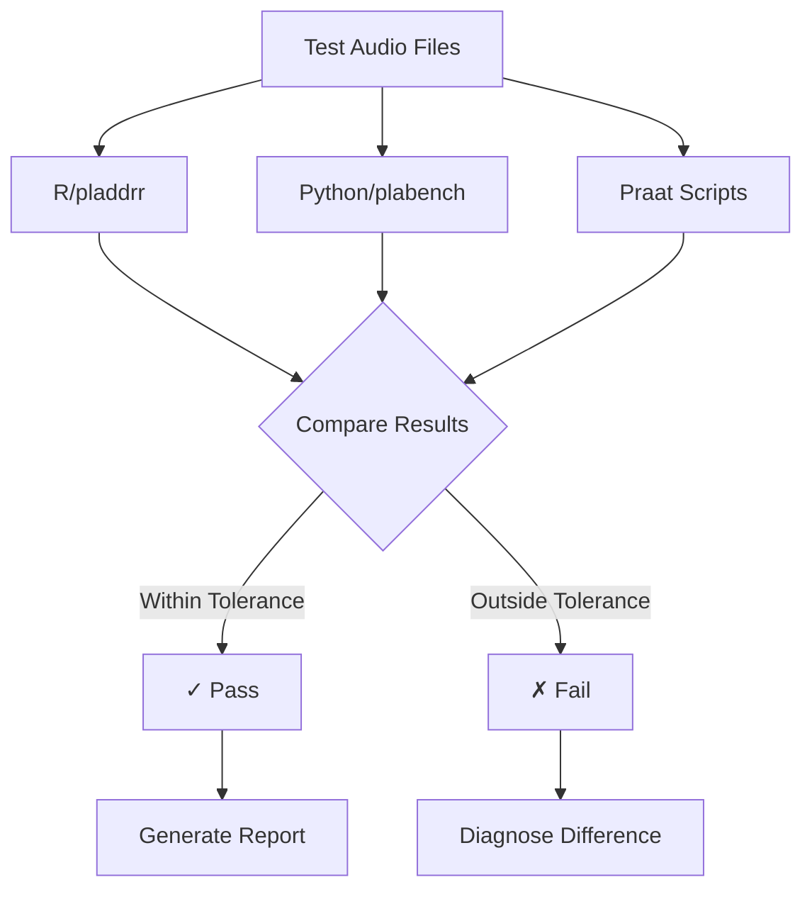

# pladdrr Test Suite

This directory contains comprehensive cross-validation tests for AVQI, DSI, and tremor analysis implementations.

## Quick Start

### 1. Run Smoke Tests (Fast)

Quick verification that all implementations work:

```bash
cd /Users/frkkan96/Documents/src/pladdrr
Rscript tests/quick_smoke_test.R
```

Expected output:
```
=============================================================
QUICK SMOKE TEST
=============================================================

=== Testing AVQI ===
Running compute_avqi()... ✓ PASSED
  AVQI: 3.142
  CPPS: 12.45 dB
  HNR: 14.23 dB
  Shimmer: 3.45%

=== Testing DSI ===
Loading and concatenating files... done
Running compute_dsi()... ✓ PASSED
  DSI: 3.45
  MPT: 15.2 s
  F0-high: 523.1 Hz
  I-low: 52.3 dB
  Jitter: 0.523%

=== Testing Tremor ===
Running analyze_tremor()... ✓ PASSED
  Frequency tremor: 4.23 Hz (intensity: 23.4%)
  Amplitude tremor: 4.87 Hz (intensity: 18.2%)
  F-cyclicality: 0.45
  A-cyclicality: 0.38

=============================================================
SMOKE TEST SUMMARY
=============================================================
Tests passed: 3
Tests failed: 0
Total tests:  3

✓ All smoke tests passed!
```

### 2. Run Cross-Validation Tests (Thorough)

Compare R, Python, and Praat implementations:

```r
# In R console
setwd("/Users/frkkan96/Documents/src/pladdrr")
source("tests/test_cross_validation.R")
run_cross_validation()
```

### 3. Generate Praat Reference Data

Create reference outputs from original Praat scripts:

```bash
cd /Users/frkkan96/Documents/src/pladdrr/tests
./generate_praat_reference.sh
```

This creates:
- `../plabench/reference_output/avqi_reference.csv`
- `../plabench/reference_output/dsi_reference.csv`
- `../plabench/reference_output/tremor_*.csv`

## Test Files

| File | Purpose | Usage |
|------|---------|-------|
| `quick_smoke_test.R` | Fast sanity check | `Rscript quick_smoke_test.R` |
| `test_cross_validation.R` | Full comparison suite | `testthat::test_file()` |
| `generate_praat_reference.sh` | Generate Praat outputs | `./generate_praat_reference.sh` |

## Prerequisites

### Required

- **R packages:** `speaker`, `testthat`, `jsonlite`
- **Test data:** `/Users/frkkan96/Documents/src/plabench/signalfiles/`

### Optional (for full validation)

- **Praat:** `/Applications/Praat.app/Contents/MacOS/Praat`
- **Python:** `python3` with `plabench` package installed
- **speakr:** R package for Praat script calling

Check prerequisites:

```r
# In R
file.exists("/Applications/Praat.app/Contents/MacOS/Praat")  # Praat
system2("python3", c("-c", "import plabench"), stdout = FALSE) == 0  # Python
requireNamespace("speakr", quietly = TRUE)  # speakr
```

## Test Data Structure

```
plabench/signalfiles/
├── AVQI/
│   └── input/
│       ├── cs*.wav  # Continuous speech files
│       └── sv*.wav  # Sustained vowel files
│
├── DSI/
│   └── input/
│       ├── mpt*.wav  # Maximum phonation time
│       ├── fh*.wav   # Highest frequency
│       ├── im*.wav   # Lowest intensity
│       └── ppq*.wav  # Jitter measurement
│
└── tremor/
    └── *.wav  # Sustained vowels for tremor
```

## Numerical Tolerances

Tests use these tolerances for cross-implementation comparison:

| Measure | Tolerance | Unit | Reason |
|---------|-----------|------|--------|
| AVQI | 0.01 | - | Composite score |
| CPPS | 0.1 | dB | FFT precision |
| HNR | 0.1 | dB | Autocorrelation |
| Shimmer | 0.01 | % | Period detection |
| DSI | 0.01 | - | Composite score |
| Tremor F | 0.1 | Hz | Spectrum peak |
| Tremor I | 1.0 | % | Power estimation |

Tolerances account for:
- Floating-point arithmetic differences
- FFT library implementations
- Minor algorithmic variations

## Test Execution Flow



## Troubleshooting

### Test Files Not Found

```bash
# Check if test data exists
ls /Users/frkkan96/Documents/src/plabench/signalfiles/AVQI/input/
ls /Users/frkkan96/Documents/src/plabench/signalfiles/DSI/input/
```

If missing, you need to add test audio files to these directories.

### R Package Not Loaded

```r
# Load pladdrr package
devtools::load_all("/Users/frkkan96/Documents/src/pladdrr")

# Or if installed
library(speaker)
```

### Python Import Error

```bash
# Verify plabench installation
python3 -c "import plabench; print(plabench.__version__)"

# If error, reinstall
cd /Users/frkkan96/Documents/src/plabench
pip install -e .
```

### Praat Not Found

```bash
# Check Praat location
ls -la /Applications/Praat.app/Contents/MacOS/Praat

# If different location, update PRAAT_EXEC in test files
```

### Numerical Differences Too Large

If tests fail due to large numerical differences:

1. Check intermediate results:
```r
# In R
pitch <- sound$to_pitch(...)
pitch$get_mean(0, 0, "hertz")

# In Python
pitch = sound.to_pitch()
pitch.get_mean()
```

2. Verify audio loading:
```r
sound <- Sound$new("test.wav")
c(sound$get_duration(), sound$get_sampling_frequency())
```

3. Check for bugs in recent changes

## Adding New Tests

### 1. Add Test Case

```r
test_that("New feature works", {
  # Arrange
  sound <- Sound$new("test.wav")

  # Act
  result <- new_function(sound)

  # Assert
  expect_true(!is.na(result))
  expect_equal(result, expected_value, tolerance = 0.01)
})
```

### 2. Add Reference Data

```bash
# Add to generate_praat_reference.sh
"$PRAAT" --utf8 --run new_script.praat input.wav output.csv
```

### 3. Update Documentation

Update `CROSS_VALIDATION_GUIDE.md` with new test procedures.

## CI/CD Integration

### GitHub Actions Example

```yaml
name: Cross-Validation Tests

on: [push, pull_request]

jobs:
  test:
    runs-on: macos-latest

    steps:
    - uses: actions/checkout@v2

    - name: Install Praat
      run: brew install --cask praat

    - name: Setup R
      uses: r-lib/actions/setup-r@v2

    - name: Install dependencies
      run: |
        Rscript -e 'install.packages(c("R6", "testthat", "jsonlite", "devtools"))'
        Rscript -e 'devtools::install(".")'

    - name: Run smoke tests
      run: Rscript tests/quick_smoke_test.R

    - name: Run cross-validation tests
      run: Rscript -e 'testthat::test_file("tests/test_cross_validation.R")'
```

## Performance Benchmarks

Typical execution times on MacBook Pro M1:

| Test | Duration | Memory |
|------|----------|--------|
| Quick smoke test | ~10-15s | <100MB |
| AVQI cross-validation | ~20-30s | ~200MB |
| DSI cross-validation | ~15-20s | ~150MB |
| Tremor cross-validation | ~10-15s | ~100MB |
| Full test suite | ~60-90s | ~300MB |

## Further Reading

- **Testing Guide:** `../CROSS_VALIDATION_GUIDE.md`
- **Implementation Status:** `../IMPLEMENTATION_STATUS.md`
- **Package README:** `../README.md`

## Support

For test-related issues:
- Contact the maintainer at `fredrik.nylen@umu.se`
- Review troubleshooting section above
- Consult CROSS_VALIDATION_GUIDE.md

---

**Last Updated:** 2025-12-02
